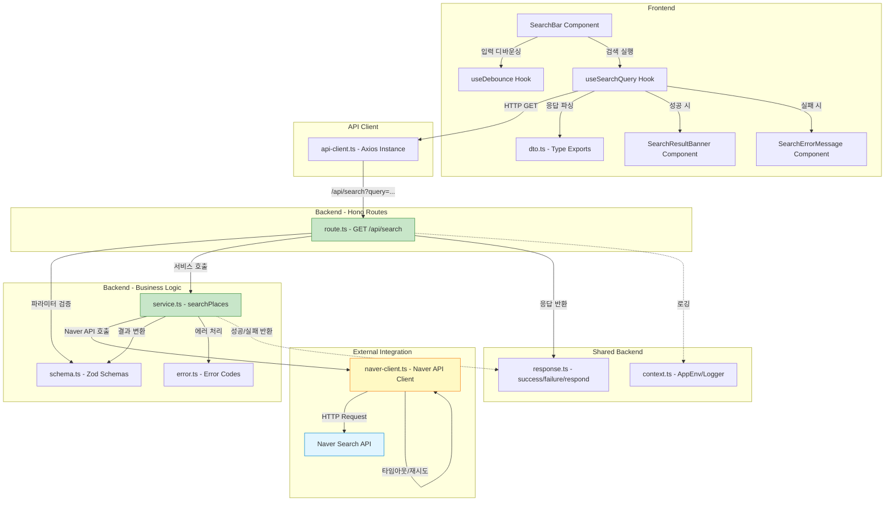

# Use Case 001 구현 계획: 장소(음식점) 검색

## 개요

본 문서는 Use Case 001 (장소 검색 기능)을 구현하기 위한 모듈 설계 및 구현 계획입니다. 사용자가 키워드로 음식점을 검색하고, Naver Search API를 통해 실시간으로 장소 데이터를 가져와 지도와 배너 형태로 표시하는 기능을 포함합니다.

### 주요 특징
- **외부 API 연동**: Naver Search API (Local)를 통한 실시간 장소 검색
- **Backend-Proxy 패턴**: 클라이언트는 Naver API를 직접 호출하지 않고, 자체 백엔드 API를 통해 간접 호출
- **DB 저장 없음**: 검색 단계에서는 DB에 저장하지 않음 (리뷰 작성 시에만 저장)
- **좌표 변환**: Naver API의 KATECH 좌표계를 WGS84로 변환

---

## 모듈 목록

### Backend 모듈

#### 1. `/src/lib/external/naver-client.ts`
- **설명**: Naver Search API 호출을 담당하는 외부 서비스 클라이언트
- **역할**:
  - API 인증 및 HTTP 요청 처리
  - 좌표 변환 (KATECH → WGS84)
  - 에러 핸들링 및 재시도 로직
  - 타임아웃 설정
  - HTML 태그 제거 및 데이터 정제

#### 2. `/src/features/search/backend/schema.ts`
- **설명**: 검색 요청/응답 스키마 정의 (Zod)
- **역할**:
  - `SearchQuerySchema`: 검색 키워드 검증 (2-50자)
  - `SearchResultItemSchema`: 검색 결과 단일 항목 스키마
  - `SearchResponseSchema`: 검색 결과 응답 스키마
  - `NaverApiResponseSchema`: Naver API 원본 응답 검증

#### 3. `/src/features/search/backend/error.ts`
- **설명**: 검색 기능 관련 에러 코드 정의
- **역할**:
  - `SEARCH_QUERY_REQUIRED`: 검색 키워드 누락
  - `SEARCH_QUERY_INVALID`: 검색 키워드 유효하지 않음
  - `SEARCH_API_ERROR`: Naver API 호출 실패
  - `SEARCH_TIMEOUT_ERROR`: API 요청 타임아웃
  - `SEARCH_RESPONSE_INVALID`: API 응답 구조 불일치

#### 4. `/src/features/search/backend/service.ts`
- **설명**: 검색 비즈니스 로직 처리
- **역할**:
  - `searchPlaces()`: Naver Client 호출 및 결과 변환
  - 에러 핸들링 및 검증
  - 결과 데이터 정제 및 매핑

#### 5. `/src/features/search/backend/route.ts`
- **설명**: Hono 기반 검색 API 라우터
- **역할**:
  - `GET /api/search?query={keyword}` 엔드포인트 정의
  - 요청 파라미터 검증
  - Service 호출 및 응답 반환

### Frontend 모듈

#### 6. `/src/features/search/lib/dto.ts`
- **설명**: 백엔드 스키마 재노출 (프론트엔드용)
- **역할**:
  - `SearchResult`, `SearchResponse` 타입 재노출
  - React Query 훅에서 사용

#### 7. `/src/features/search/hooks/useSearchQuery.ts`
- **설명**: 검색 API 호출 React Query 훅
- **역할**:
  - `useSearchQuery(keyword)` 훅 제공
  - API 호출 및 캐싱
  - 에러 처리

#### 8. `/src/features/search/hooks/useDebounce.ts`
- **설명**: 디바운싱 유틸리티 훅
- **역할**:
  - 사용자 입력 디바운싱 (500ms)
  - 불필요한 API 호출 방지

#### 9. `/src/features/search/components/search-bar.tsx`
- **설명**: 검색 입력 필드 컴포넌트
- **역할**:
  - 검색어 입력 UI
  - 실시간 유효성 검증 메시지 표시
  - Enter 키 및 검색 버튼 이벤트 처리

#### 10. `/src/features/search/components/search-result-banner.tsx`
- **설명**: 검색 결과 배너 컴포넌트
- **역할**:
  - 검색된 장소 목록 표시
  - 장소명, 주소, 업종 렌더링
  - "리뷰 작성하기" 버튼 제공

#### 11. `/src/features/search/components/search-error-message.tsx`
- **설명**: 검색 오류 메시지 컴포넌트
- **역할**:
  - 검색 결과 없음 메시지
  - API 오류 메시지
  - 접근성 (role="alert")

### 통합 모듈

#### 12. `/src/backend/hono/app.ts` (수정)
- **설명**: Hono 앱에 검색 라우터 등록
- **역할**:
  - `registerSearchRoutes(app)` 호출 추가

#### 13. `/src/app/page.tsx` (수정)
- **설명**: 메인 페이지에 검색 컴포넌트 통합
- **역할**:
  - `SearchBar` 및 `SearchResultBanner` 컴포넌트 배치
  - 검색 결과에 따른 지도 뷰 이동 로직

---

## 모듈 관계 다이어그램



---

## 구현 계획

### Phase 1: 외부 서비스 클라이언트 구현

#### 1.1. `/src/lib/external/naver-client.ts`

**목적**: Naver Search API 호출을 캡슐화하고, 에러 처리 및 데이터 변환을 담당

**구현 내용**:
```typescript
import axios, { AxiosInstance, AxiosError } from 'axios';
import { z } from 'zod';

// 환경 변수 타입 정의
const NaverCredentialsSchema = z.object({
  clientId: z.string().min(1, 'NEXT_PUBLIC_NCP_CLIENT_ID is required'),
  clientSecret: z.string().min(1, 'NCP_CLIENT_SECRET is required'),
});

// Naver API 원본 응답 스키마
const NaverApiItemSchema = z.object({
  title: z.string(),
  address: z.string(),
  roadAddress: z.string(),
  category: z.string(),
  mapx: z.string(), // KATECH 좌표
  mapy: z.string(), // KATECH 좌표
  link: z.string(),
});

const NaverApiResponseSchema = z.object({
  items: z.array(NaverApiItemSchema),
  total: z.number(),
  start: z.number(),
  display: z.number(),
});

// 변환된 검색 결과 타입
export interface NaverSearchResult {
  name: string;
  address: string;
  roadAddress: string;
  category: string;
  latitude: number;
  longitude: number;
  externalId: string;
}

// 에러 타입
export class NaverApiError extends Error {
  constructor(
    message: string,
    public statusCode?: number,
    public originalError?: unknown
  ) {
    super(message);
    this.name = 'NaverApiError';
  }
}

export class NaverApiTimeoutError extends NaverApiError {
  constructor() {
    super('Naver API request timed out', 504);
    this.name = 'NaverApiTimeoutError';
  }
}

// HTML 태그 제거 유틸
const stripHtmlTags = (text: string): string => {
  return text.replace(/<\/?[^>]+(>|$)/g, '');
};

// 좌표 변환: KATECH → WGS84
const convertCoordinates = (mapx: string, mapy: string): { longitude: number; latitude: number } => {
  return {
    longitude: parseInt(mapx, 10) / 10000000,
    latitude: parseInt(mapy, 10) / 10000000,
  };
};

// Naver Search API 클라이언트 클래스
export class NaverSearchClient {
  private client: AxiosInstance;

  constructor(clientId: string, clientSecret: string) {
    // 인증 정보 검증
    const credentials = NaverCredentialsSchema.parse({ clientId, clientSecret });

    this.client = axios.create({
      baseURL: 'https://openapi.naver.com/v1/search',
      headers: {
        'X-Naver-Client-Id': credentials.clientId,
        'X-Naver-Client-Secret': credentials.clientSecret,
      },
      timeout: 10000, // 10초 타임아웃
    });
  }

  /**
   * 장소 검색
   * @param query 검색 키워드
   * @param display 결과 개수 (기본 5개)
   * @returns 검색 결과 배열
   */
  async searchLocal(query: string, display = 5): Promise<NaverSearchResult[]> {
    try {
      const response = await this.client.get('/local.json', {
        params: {
          query,
          display,
        },
      });

      // 응답 스키마 검증
      const parsed = NaverApiResponseSchema.safeParse(response.data);

      if (!parsed.success) {
        throw new NaverApiError(
          'Invalid Naver API response structure',
          500,
          parsed.error.format()
        );
      }

      // 데이터 변환
      return parsed.data.items.map((item) => {
        const { longitude, latitude } = convertCoordinates(item.mapx, item.mapy);

        return {
          name: stripHtmlTags(item.title),
          address: item.address,
          roadAddress: item.roadAddress,
          category: item.category,
          latitude,
          longitude,
          externalId: item.link,
        };
      });
    } catch (error) {
      // 타임아웃 에러
      if (axios.isAxiosError(error) && error.code === 'ECONNABORTED') {
        throw new NaverApiTimeoutError();
      }

      // Axios 에러
      if (axios.isAxiosError(error)) {
        throw new NaverApiError(
          error.response?.data?.errorMessage ?? 'Naver API request failed',
          error.response?.status ?? 500,
          error
        );
      }

      // 기타 에러
      if (error instanceof NaverApiError) {
        throw error;
      }

      throw new NaverApiError('Unexpected error during Naver API call', 500, error);
    }
  }
}

// 싱글톤 인스턴스 생성 (환경 변수에서 인증 정보 로드)
let clientInstance: NaverSearchClient | null = null;

export const getNaverSearchClient = (): NaverSearchClient => {
  if (!clientInstance) {
    const clientId = process.env.NEXT_PUBLIC_NCP_CLIENT_ID;
    const clientSecret = process.env.NCP_CLIENT_SECRET;

    if (!clientId || !clientSecret) {
      throw new Error('Naver API credentials are not configured');
    }

    clientInstance = new NaverSearchClient(clientId, clientSecret);
  }

  return clientInstance;
};
```

**단위 테스트 시나리오** (`naver-client.test.ts`):
- ✅ 정상 응답 시 좌표 변환 및 HTML 태그 제거 확인
- ✅ 빈 검색 결과 처리 (items: [])
- ✅ 타임아웃 에러 발생 시 `NaverApiTimeoutError` 반환
- ✅ 잘못된 인증 정보 시 에러 발생
- ✅ 잘못된 API 응답 구조 시 스키마 검증 실패

---

### Phase 2: Backend 모듈 구현

#### 2.1. `/src/features/search/backend/schema.ts`

```typescript
import { z } from 'zod';

// 검색 요청 스키마
export const SearchQuerySchema = z.object({
  query: z
    .string()
    .min(2, { message: '검색어는 최소 2자 이상이어야 합니다.' })
    .max(50, { message: '검색어는 최대 50자까지 입력 가능합니다.' }),
});

export type SearchQuery = z.infer<typeof SearchQuerySchema>;

// 검색 결과 항목 스키마
export const SearchResultItemSchema = z.object({
  name: z.string(),
  address: z.string(),
  roadAddress: z.string(),
  category: z.string(),
  latitude: z.number(),
  longitude: z.number(),
  externalId: z.string(),
});

export type SearchResultItem = z.infer<typeof SearchResultItemSchema>;

// 검색 응답 스키마
export const SearchResponseSchema = z.object({
  data: z.array(SearchResultItemSchema),
});

export type SearchResponse = z.infer<typeof SearchResponseSchema>;
```

#### 2.2. `/src/features/search/backend/error.ts`

```typescript
export const searchErrorCodes = {
  queryRequired: 'SEARCH_QUERY_REQUIRED',
  queryInvalid: 'SEARCH_QUERY_INVALID',
  apiError: 'SEARCH_API_ERROR',
  timeoutError: 'SEARCH_TIMEOUT_ERROR',
  responseInvalid: 'SEARCH_RESPONSE_INVALID',
} as const;

type SearchErrorValue = (typeof searchErrorCodes)[keyof typeof searchErrorCodes];

export type SearchServiceError = SearchErrorValue;
```

#### 2.3. `/src/features/search/backend/service.ts`

```typescript
import {
  failure,
  success,
  type HandlerResult,
} from '@/backend/http/response';
import {
  getNaverSearchClient,
  NaverApiError,
  NaverApiTimeoutError,
} from '@/lib/external/naver-client';
import {
  SearchResultItemSchema,
  type SearchResultItem,
} from '@/features/search/backend/schema';
import {
  searchErrorCodes,
  type SearchServiceError,
} from '@/features/search/backend/error';

export const searchPlaces = async (
  query: string,
): Promise<HandlerResult<SearchResultItem[], SearchServiceError, unknown>> => {
  try {
    const client = getNaverSearchClient();
    const results = await client.searchLocal(query, 5);

    // 결과 배열 스키마 검증
    const validatedResults: SearchResultItem[] = [];

    for (const item of results) {
      const parsed = SearchResultItemSchema.safeParse(item);

      if (!parsed.success) {
        return failure(
          500,
          searchErrorCodes.responseInvalid,
          'Search result validation failed',
          parsed.error.format()
        );
      }

      validatedResults.push(parsed.data);
    }

    return success(validatedResults);
  } catch (error) {
    // 타임아웃 에러
    if (error instanceof NaverApiTimeoutError) {
      return failure(
        504,
        searchErrorCodes.timeoutError,
        '요청 시간이 초과되었습니다. 잠시 후 다시 시도해주세요.'
      );
    }

    // Naver API 에러
    if (error instanceof NaverApiError) {
      return failure(
        error.statusCode ?? 500,
        searchErrorCodes.apiError,
        '검색 중 오류가 발생했습니다. 잠시 후 다시 시도해주세요.',
        error.originalError
      );
    }

    // 기타 에러
    return failure(
      500,
      searchErrorCodes.apiError,
      '검색 중 예상치 못한 오류가 발생했습니다.',
      error instanceof Error ? error.message : String(error)
    );
  }
};
```

**단위 테스트 시나리오** (`service.test.ts`):
- ✅ 정상 검색 결과 반환 (success)
- ✅ 빈 검색 결과 처리 (success with empty array)
- ✅ Naver API 타임아웃 시 `SEARCH_TIMEOUT_ERROR` 반환
- ✅ Naver API 에러 시 `SEARCH_API_ERROR` 반환
- ✅ 응답 스키마 검증 실패 시 `SEARCH_RESPONSE_INVALID` 반환

#### 2.4. `/src/features/search/backend/route.ts`

```typescript
import type { Hono } from 'hono';
import {
  failure,
  respond,
  type ErrorResult,
} from '@/backend/http/response';
import {
  getLogger,
  type AppEnv,
} from '@/backend/hono/context';
import { SearchQuerySchema } from '@/features/search/backend/schema';
import { searchPlaces } from './service';
import {
  searchErrorCodes,
  type SearchServiceError,
} from './error';

export const registerSearchRoutes = (app: Hono<AppEnv>) => {
  app.get('/search', async (c) => {
    const queryParam = c.req.query('query');

    // 쿼리 파라미터 누락 체크
    if (!queryParam) {
      return respond(
        c,
        failure(
          400,
          searchErrorCodes.queryRequired,
          '검색어를 입력하세요.'
        )
      );
    }

    // 쿼리 파라미터 검증
    const parsedQuery = SearchQuerySchema.safeParse({ query: queryParam });

    if (!parsedQuery.success) {
      return respond(
        c,
        failure(
          400,
          searchErrorCodes.queryInvalid,
          parsedQuery.error.errors[0]?.message ?? '검색어가 유효하지 않습니다.',
          parsedQuery.error.format()
        )
      );
    }

    const logger = getLogger(c);
    const result = await searchPlaces(parsedQuery.data.query);

    // 에러 로깅
    if (!result.ok) {
      const errorResult = result as ErrorResult<SearchServiceError, unknown>;

      if (errorResult.error.code === searchErrorCodes.apiError) {
        logger.error('Search API error', errorResult.error);
      } else if (errorResult.error.code === searchErrorCodes.timeoutError) {
        logger.warn('Search API timeout', errorResult.error);
      }
    } else {
      logger.info(`Search completed: "${parsedQuery.data.query}", ${result.data.length} results`);
    }

    return respond(c, result);
  });
};
```

#### 2.5. `/src/backend/hono/app.ts` 수정

```typescript
import { Hono } from 'hono';
import { errorBoundary } from '@/backend/middleware/error';
import { withAppContext } from '@/backend/middleware/context';
import { withSupabase } from '@/backend/middleware/supabase';
import { registerExampleRoutes } from '@/features/example/backend/route';
import { registerSearchRoutes } from '@/features/search/backend/route'; // 추가
import type { AppEnv } from '@/backend/hono/context';

let singletonApp: Hono<AppEnv> | null = null;

export const createHonoApp = () => {
  if (singletonApp) {
    return singletonApp;
  }

  const app = new Hono<AppEnv>();

  app.use('*', errorBoundary());
  app.use('*', withAppContext());
  app.use('*', withSupabase());

  registerExampleRoutes(app);
  registerSearchRoutes(app); // 추가

  singletonApp = app;

  return app;
};
```

---

### Phase 3: Frontend 모듈 구현

#### 3.1. `/src/features/search/lib/dto.ts`

```typescript
export {
  SearchQuerySchema,
  SearchResultItemSchema,
  SearchResponseSchema,
  type SearchQuery,
  type SearchResultItem,
  type SearchResponse,
} from '@/features/search/backend/schema';
```

#### 3.2. `/src/features/search/hooks/useDebounce.ts`

```typescript
'use client';

import { useEffect, useState } from 'react';

/**
 * 디바운싱 훅
 * @param value 입력 값
 * @param delay 지연 시간 (밀리초)
 * @returns 디바운싱된 값
 */
export const useDebounce = <T>(value: T, delay: number): T => {
  const [debouncedValue, setDebouncedValue] = useState<T>(value);

  useEffect(() => {
    const handler = setTimeout(() => {
      setDebouncedValue(value);
    }, delay);

    return () => {
      clearTimeout(handler);
    };
  }, [value, delay]);

  return debouncedValue;
};
```

#### 3.3. `/src/features/search/hooks/useSearchQuery.ts`

```typescript
'use client';

import { useQuery } from '@tanstack/react-query';
import { apiClient, extractApiErrorMessage } from '@/lib/remote/api-client';
import { SearchResponseSchema, type SearchResponse } from '@/features/search/lib/dto';

const fetchSearch = async (query: string): Promise<SearchResponse> => {
  try {
    const { data } = await apiClient.get('/api/search', {
      params: { query },
    });

    // 응답 스키마 검증
    const parsed = SearchResponseSchema.parse(data);
    return parsed;
  } catch (error) {
    const message = extractApiErrorMessage(error, '검색 중 오류가 발생했습니다.');
    throw new Error(message);
  }
};

export const useSearchQuery = (query: string) => {
  return useQuery({
    queryKey: ['search', query],
    queryFn: () => fetchSearch(query),
    enabled: Boolean(query) && query.trim().length >= 2,
    staleTime: 60 * 1000, // 1분
    retry: 1, // 1회 재시도
  });
};
```

#### 3.4. `/src/features/search/components/search-bar.tsx`

```typescript
'use client';

import { useState } from 'react';
import { Search } from 'lucide-react';
import { Input } from '@/components/ui/input';
import { Button } from '@/components/ui/button';
import { cn } from '@/lib/utils';

interface SearchBarProps {
  onSearch: (query: string) => void;
  className?: string;
}

export const SearchBar = ({ onSearch, className }: SearchBarProps) => {
  const [query, setQuery] = useState('');
  const [error, setError] = useState<string | null>(null);

  const handleSubmit = (e: React.FormEvent) => {
    e.preventDefault();

    // 클라이언트 측 검증
    const trimmedQuery = query.trim();

    if (trimmedQuery.length < 2) {
      setError('검색어는 최소 2자 이상이어야 합니다.');
      return;
    }

    if (trimmedQuery.length > 50) {
      setError('검색어는 최대 50자까지 입력 가능합니다.');
      return;
    }

    setError(null);
    onSearch(trimmedQuery);
  };

  return (
    <form onSubmit={handleSubmit} className={cn('space-y-2', className)}>
      <div className="flex gap-2">
        <Input
          type="text"
          placeholder="장소명을 입력하세요 (예: 강남역 파스타)"
          value={query}
          onChange={(e) => {
            setQuery(e.target.value);
            setError(null);
          }}
          aria-label="장소 검색"
          className="flex-1"
        />
        <Button type="submit" size="icon" aria-label="검색">
          <Search className="h-4 w-4" />
        </Button>
      </div>
      {error && (
        <p className="text-sm text-red-600" role="alert">
          {error}
        </p>
      )}
    </form>
  );
};
```

**QA Sheet** (`search-bar.qa.md`):
- ✅ 검색어 입력 후 Enter 키 누르면 검색 실행
- ✅ 검색 버튼 클릭 시 검색 실행
- ✅ 2자 미만 입력 시 "검색어는 최소 2자 이상이어야 합니다." 메시지 표시
- ✅ 50자 초과 입력 시 "검색어는 최대 50자까지 입력 가능합니다." 메시지 표시
- ✅ 유효한 검색어 입력 후 검색 시 에러 메시지 사라짐
- ✅ `aria-label` 속성으로 접근성 지원

#### 3.5. `/src/features/search/components/search-result-banner.tsx`

```typescript
'use client';

import { Button } from '@/components/ui/button';
import { Card, CardHeader, CardTitle, CardDescription, CardContent } from '@/components/ui/card';
import { MapPin } from 'lucide-react';
import { useRouter } from 'next/navigation';
import type { SearchResultItem } from '@/features/search/lib/dto';

interface SearchResultBannerProps {
  results: SearchResultItem[];
}

export const SearchResultBanner = ({ results }: SearchResultBannerProps) => {
  const router = useRouter();

  if (results.length === 0) {
    return null;
  }

  return (
    <div className="space-y-3">
      <h2 className="text-lg font-semibold">검색 결과</h2>
      <div className="space-y-2">
        {results.map((result, index) => (
          <Card key={`${result.externalId}-${index}`}>
            <CardHeader>
              <CardTitle className="flex items-center gap-2">
                <MapPin className="h-4 w-4 text-primary" />
                {result.name}
              </CardTitle>
              <CardDescription>{result.category}</CardDescription>
            </CardHeader>
            <CardContent className="space-y-2">
              <p className="text-sm text-muted-foreground">
                {result.roadAddress || result.address}
              </p>
              <Button
                onClick={() => {
                  // Use Case 002: 리뷰 작성 페이지로 이동
                  // 장소 정보를 쿼리 파라미터로 전달
                  const params = new URLSearchParams({
                    name: result.name,
                    address: result.address,
                    roadAddress: result.roadAddress,
                    category: result.category,
                    latitude: String(result.latitude),
                    longitude: String(result.longitude),
                    externalId: result.externalId,
                  });

                  router.push(`/review/new?${params.toString()}`);
                }}
                size="sm"
                className="w-full"
              >
                리뷰 작성하기
              </Button>
            </CardContent>
          </Card>
        ))}
      </div>
    </div>
  );
};
```

**QA Sheet** (`search-result-banner.qa.md`):
- ✅ 검색 결과가 있을 때 카드 목록 표시
- ✅ 각 카드에 장소명, 업종, 주소 표시
- ✅ "리뷰 작성하기" 버튼 클릭 시 `/review/new?...` 페이지로 이동
- ✅ 쿼리 파라미터에 장소 정보 포함 확인
- ✅ 검색 결과 없을 때 아무것도 렌더링하지 않음

#### 3.6. `/src/features/search/components/search-error-message.tsx`

```typescript
'use client';

import { AlertCircle, Search } from 'lucide-react';
import { Alert, AlertTitle, AlertDescription } from '@/components/ui/alert';

interface SearchErrorMessageProps {
  type: 'no-results' | 'api-error' | 'timeout';
  message?: string;
}

export const SearchErrorMessage = ({ type, message }: SearchErrorMessageProps) => {
  const getContent = () => {
    switch (type) {
      case 'no-results':
        return {
          icon: <Search className="h-4 w-4" />,
          title: '검색 결과가 없습니다',
          description: message ?? '다른 키워드로 검색해주세요.',
        };
      case 'timeout':
        return {
          icon: <AlertCircle className="h-4 w-4" />,
          title: '요청 시간이 초과되었습니다',
          description: message ?? '잠시 후 다시 시도해주세요.',
        };
      case 'api-error':
      default:
        return {
          icon: <AlertCircle className="h-4 w-4" />,
          title: '검색 중 오류가 발생했습니다',
          description: message ?? '잠시 후 다시 시도해주세요.',
        };
    }
  };

  const content = getContent();

  return (
    <Alert variant={type === 'no-results' ? 'default' : 'destructive'} role="alert">
      {content.icon}
      <AlertTitle>{content.title}</AlertTitle>
      <AlertDescription>{content.description}</AlertDescription>
    </Alert>
  );
};
```

**QA Sheet** (`search-error-message.qa.md`):
- ✅ `type="no-results"` 시 "검색 결과가 없습니다" 표시
- ✅ `type="api-error"` 시 "검색 중 오류가 발생했습니다" 표시
- ✅ `type="timeout"` 시 "요청 시간이 초과되었습니다" 표시
- ✅ `role="alert"` 속성으로 스크린 리더 접근성 지원

---

### Phase 4: 메인 페이지 통합

#### 4.1. `/src/app/page.tsx` 수정

```typescript
'use client';

import { useState } from 'react';
import { SearchBar } from '@/features/search/components/search-bar';
import { SearchResultBanner } from '@/features/search/components/search-result-banner';
import { SearchErrorMessage } from '@/features/search/components/search-error-message';
import { useSearchQuery } from '@/features/search/hooks/useSearchQuery';
import { useDebounce } from '@/features/search/hooks/useDebounce';
// 지도 컴포넌트는 향후 구현 예정

export default function HomePage() {
  const [searchQuery, setSearchQuery] = useState('');
  const debouncedQuery = useDebounce(searchQuery, 500);

  const { data, error, isLoading } = useSearchQuery(debouncedQuery);

  const handleSearch = (query: string) => {
    setSearchQuery(query);
  };

  return (
    <div className="container mx-auto p-4 space-y-6">
      <h1 className="text-3xl font-bold">맛집 리뷰 지도</h1>

      <SearchBar onSearch={handleSearch} />

      {isLoading && <p className="text-muted-foreground">검색 중...</p>}

      {error && (
        <SearchErrorMessage
          type="api-error"
          message={error instanceof Error ? error.message : undefined}
        />
      )}

      {data && data.data.length === 0 && !isLoading && (
        <SearchErrorMessage type="no-results" />
      )}

      {data && data.data.length > 0 && <SearchResultBanner results={data.data} />}

      {/* 지도 컴포넌트는 향후 추가 예정 */}
      <div className="h-96 bg-muted rounded-lg flex items-center justify-center">
        <p className="text-muted-foreground">지도 영역 (향후 구현)</p>
      </div>
    </div>
  );
}
```

**QA Sheet** (`home-page.qa.md`):
- ✅ 페이지 로드 시 검색창과 지도 영역 표시
- ✅ 검색어 입력 후 500ms 디바운싱 적용 확인
- ✅ 검색 중일 때 "검색 중..." 메시지 표시
- ✅ 검색 성공 시 결과 배너 표시
- ✅ 검색 결과 없을 때 "검색 결과가 없습니다" 메시지 표시
- ✅ API 오류 시 에러 메시지 표시

---

## 환경 변수 설정

`.env.local` 파일에 다음 환경 변수를 추가해야 합니다:

```env
# Naver Cloud Platform - 클라이언트 ID (공개 가능)
NEXT_PUBLIC_NCP_CLIENT_ID=your_naver_client_id_here

# Naver Cloud Platform - 클라이언트 시크릿 (서버 전용, 비공개)
NCP_CLIENT_SECRET=your_naver_client_secret_here
```

---

## 테스트 계획

### 단위 테스트

1. **`naver-client.test.ts`**: Naver API 클라이언트 테스트
2. **`service.test.ts`**: 검색 서비스 로직 테스트

### 통합 테스트

1. **API 엔드포인트 테스트**: `GET /api/search?query=...`
   - 정상 응답 (200)
   - 쿼리 누락 (400)
   - 쿼리 유효하지 않음 (400)
   - Naver API 오류 (500)
   - 타임아웃 (504)

### E2E 테스트

1. 사용자가 메인 페이지에서 검색어 입력 → 결과 배너 표시
2. 검색 결과 없을 때 메시지 표시
3. "리뷰 작성하기" 버튼 클릭 → 리뷰 작성 페이지로 이동

---

## 구현 순서

1. **Phase 1**: 외부 서비스 클라이언트 구현 (`naver-client.ts`)
2. **Phase 2**: Backend 모듈 구현 (schema, error, service, route)
3. **Phase 3**: Frontend 모듈 구현 (hooks, components)
4. **Phase 4**: 메인 페이지 통합
5. **테스트**: 단위 테스트 및 통합 테스트 작성
6. **QA**: UI 테스트 시트 기반 검증

---

## 참고 문서

- Use Case Spec: `/docs/usecases/001/spec.md`
- Naver API 문서: `/docs/external/naver_map.md`
- Backend Architecture: `CLAUDE.md` - Backend Layer
- Database: `/docs/database.md`

---

## 주의사항

1. **보안**: `NCP_CLIENT_SECRET`은 절대 클라이언트에 노출되지 않도록 서버 전용 환경 변수로 관리
2. **에러 처리**: 모든 Naver API 호출은 try-catch로 감싸고, 사용자 친화적인 메시지 반환
3. **성능**: 디바운싱으로 불필요한 API 호출 방지 (500ms)
4. **접근성**: 모든 입력 필드와 에러 메시지에 적절한 ARIA 속성 추가
5. **타임아웃**: Naver API 호출 시 10초 타임아웃 설정
6. **좌표 변환**: KATECH → WGS84 변환 공식 정확히 적용 (`mapx / 10000000`)
