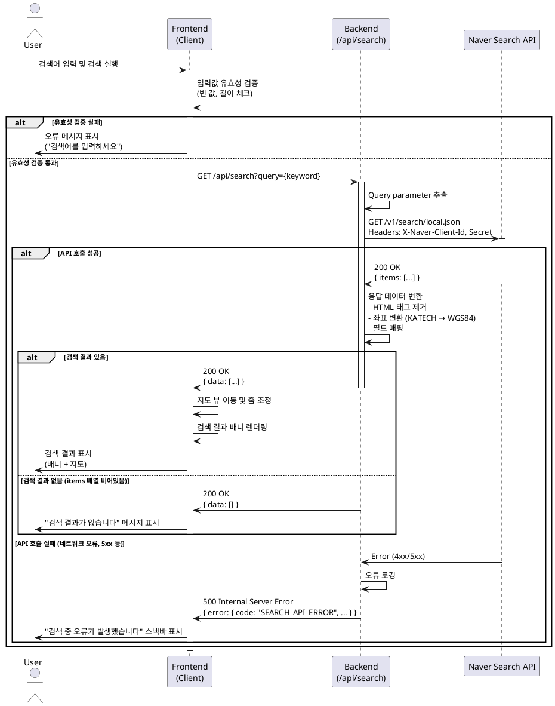

# Use Case 001: 장소(음식점) 검색

## 개요

사용자가 메인 페이지에서 키워드를 입력하여 음식점을 검색하고, 검색 결과를 지도 및 배너 형태로 확인하는 기능입니다. 외부 지도 API(Naver Search API)를 통해 장소 데이터를 가져오며, 필요시 자체 DB에 장소 정보를 저장합니다.

---

## Primary Actor

**탐색자 (Explorer)**: 지도를 통해 맛집을 검색하고 장소 정보를 확인하려는 사용자

---

## Precondition

- 사용자가 메인 페이지(`/`)에 접속한 상태입니다.
- 지도 컴포넌트가 정상적으로 로드되어 있습니다.
- 검색창이 화면에 표시되어 있습니다.

---

## Trigger

사용자가 검색 입력 필드에 키워드(예: "강남역 파스타", "홍대 카페")를 입력하고 검색을 실행합니다. (Enter 키 입력 또는 검색 버튼 클릭)

---

## Main Scenario

### 1. 사용자 입력
1. 사용자가 메인 페이지 상단의 검색 입력 필드에 검색 키워드를 입력합니다.
2. 사용자가 Enter 키를 누르거나 검색 버튼을 클릭합니다.

### 2. 클라이언트 처리
1. 프론트엔드가 입력값의 유효성을 검증합니다. (빈 값, 최소/최대 길이)
2. 유효한 경우, 백엔드 API(`/api/search`)로 검색 요청을 전송합니다.

### 3. 백엔드 처리
1. 백엔드가 요청을 수신하고 query parameter를 추출합니다.
2. Naver Search API(Local)를 호출하여 장소 목록을 조회합니다.
   - API Endpoint: `https://openapi.naver.com/v1/search/local.json`
   - Headers: `X-Naver-Client-Id`, `X-Naver-Client-Secret`
3. 외부 API로부터 장소 데이터를 수신합니다.
   - 응답 데이터: `title`, `address`, `category`, `mapx`, `mapy`, `link` 등
4. 응답 데이터를 클라이언트가 사용 가능한 형태로 변환합니다.
   - `mapx`, `mapy` → `longitude`, `latitude` (좌표 변환 필요)
5. 변환된 데이터를 클라이언트로 반환합니다.

### 4. 결과 표시
1. 프론트엔드가 검색 결과를 수신합니다.
2. 지도 뷰가 검색된 장소의 위치로 이동(pan)하고 적절한 줌 레벨로 조정됩니다.
3. 검색 결과가 배너 형태로 화면에 표시됩니다.
   - 배너 내용: 장소명, 주소, 업종, "리뷰 작성하기" 버튼
4. 사용자는 배너의 "리뷰 작성하기" 버튼을 클릭하여 리뷰 작성 페이지로 이동할 수 있습니다.

---

## Edge Cases

### 1. 입력 유효성 오류
- **상황**: 검색어가 비어있거나 허용된 길이 범위를 벗어남
- **처리**: 검색 입력 필드 주변에 "검색어를 입력하세요" 또는 "검색어는 2자 이상 50자 이하여야 합니다" 메시지 표시
- **HTTP Status**: N/A (클라이언트 측 검증)

### 2. 검색 결과 없음
- **상황**: Naver API가 일치하는 장소를 찾지 못함 (items 배열이 비어있음)
- **처리**: "검색 결과가 없습니다. 다른 키워드로 검색해주세요" 메시지 표시
- **HTTP Status**: 200 (정상 응답이나 데이터가 없음)

### 3. 외부 API 오류
- **상황**: Naver API 호출 실패 (네트워크 오류, API 키 만료, 5xx 서버 오류)
- **처리**: "검색 중 오류가 발생했습니다. 잠시 후 다시 시도해주세요" 스낵바 또는 모달 표시
- **Error Code**: `SEARCH_API_ERROR`
- **HTTP Status**: 500

### 4. 요청 타임아웃
- **상황**: Naver API 응답이 10초 이상 지연됨
- **처리**: 요청을 중단하고 "요청 시간이 초과되었습니다" 메시지 표시
- **Error Code**: `SEARCH_TIMEOUT_ERROR`
- **HTTP Status**: 504

### 5. 유효하지 않은 API 응답
- **상황**: Naver API 응답 구조가 예상과 다름 (스키마 불일치)
- **처리**: 로그를 기록하고 사용자에게 일반 오류 메시지 표시
- **Error Code**: `SEARCH_RESPONSE_INVALID`
- **HTTP Status**: 500

---

## Business Rules

### 1. 검색 키워드 제약사항
- 최소 길이: 2자
- 최대 길이: 50자
- 허용 문자: 한글, 영문, 숫자, 공백

### 2. 검색 결과 제한
- 최대 표시 개수: 5개 (Naver API의 `display` 파라미터)
- 정렬 순서: Naver API 기본 정렬 (관련도순)

### 3. 좌표 변환 규칙
- Naver API는 KATECH 좌표계 사용 (`mapx`, `mapy`)
- WGS84 좌표계로 변환 필요: `longitude = mapx / 10000000`, `latitude = mapy / 10000000`

### 4. DB 저장 정책
- 검색 단계에서는 DB에 장소를 저장하지 **않습니다**.
- 장소 저장은 사용자가 해당 장소에 **첫 번째 리뷰를 작성할 때**만 수행됩니다. (Use Case 002 참조)

### 5. External Service Integration

#### 5.1. Naver Search API (Local)
- **목적**: 키워드 기반 장소 검색
- **문서**: `/docs/external/naver_map.md` 참조
- **인증 방식**: HTTP Header (`X-Naver-Client-Id`, `X-Naver-Client-Secret`)
- **환경 변수**:
  - `NEXT_PUBLIC_NCP_CLIENT_ID`: 클라이언트 ID (공개 가능)
  - `NCP_CLIENT_SECRET`: 클라이언트 시크릿 (서버 전용, 비공개)

#### 5.2. 연동 플로우
1. 클라이언트 → 백엔드 API (`/api/search?query=...`)
2. 백엔드 → Naver Search API (`GET https://openapi.naver.com/v1/search/local.json`)
3. Naver API → 백엔드 (장소 목록 JSON 응답)
4. 백엔드 → 클라이언트 (변환된 데이터 반환)

#### 5.3. 주요 응답 필드 매핑
| Naver API 필드 | 내부 데이터 필드 | 설명 |
|---------------|----------------|------|
| `title` | `name` | 장소명 (HTML 태그 제거 필요) |
| `address` | `address` | 지번 주소 |
| `roadAddress` | `roadAddress` | 도로명 주소 |
| `category` | `category` | 업종 분류 |
| `mapx` | `longitude` | 경도 (변환: `/10000000`) |
| `mapy` | `latitude` | 위도 (변환: `/10000000`) |
| `link` | `externalId` | Naver 장소 고유 ID |

### 6. API Specification

#### Endpoint: `GET /api/search`

##### Request
```typescript
// Query Parameters
{
  query: string; // 검색 키워드 (필수, 2-50자)
}
```

##### Response (Success - 200 OK)
```typescript
{
  data: Array<{
    name: string;           // 장소명 (HTML 태그 제거됨)
    address: string;        // 지번 주소
    roadAddress: string;    // 도로명 주소
    category: string;       // 업종 (예: "음식점>한식>육류,고기요리")
    latitude: number;       // 위도 (WGS84)
    longitude: number;      // 경도 (WGS84)
    externalId: string;     // Naver 장소 링크
  }>;
}
```

##### Response (Error)
```typescript
{
  error: {
    code: string;           // Error code (see below)
    message: string;        // 사용자 친화적 오류 메시지
    details?: unknown;      // 추가 디버깅 정보 (선택)
  }
}
```

##### Error Codes
| Error Code | HTTP Status | 설명 |
|-----------|-------------|------|
| `SEARCH_QUERY_REQUIRED` | 400 | 검색 키워드가 누락됨 |
| `SEARCH_QUERY_INVALID` | 400 | 검색 키워드가 유효하지 않음 (길이 제한 등) |
| `SEARCH_API_ERROR` | 500 | Naver API 호출 실패 |
| `SEARCH_TIMEOUT_ERROR` | 504 | API 요청 타임아웃 |
| `SEARCH_RESPONSE_INVALID` | 500 | API 응답 구조가 예상과 다름 |

##### Request Schema (Zod)
```typescript
export const SearchQuerySchema = z.object({
  query: z.string()
    .min(2, { message: "검색어는 최소 2자 이상이어야 합니다." })
    .max(50, { message: "검색어는 최대 50자까지 입력 가능합니다." })
});
```

##### Response Schema (Zod)
```typescript
export const SearchResultItemSchema = z.object({
  name: z.string(),
  address: z.string(),
  roadAddress: z.string(),
  category: z.string(),
  latitude: z.number(),
  longitude: z.number(),
  externalId: z.string()
});

export const SearchResponseSchema = z.object({
  data: z.array(SearchResultItemSchema)
});

export type SearchResult = z.infer<typeof SearchResultItemSchema>;
export type SearchResponse = z.infer<typeof SearchResponseSchema>;
```

---

## Database Operations

### 1. 사용할 테이블
이 유스케이스에서는 **DB 조회 및 저장 작업을 수행하지 않습니다**.

### 2. 이유
- 검색은 실시간으로 Naver API를 통해 수행됩니다.
- 장소 정보는 사용자가 리뷰를 작성할 때만 `places` 테이블에 저장됩니다. (Use Case 002 참조)

### 3. 향후 고려사항 (MVP 이후)
- 검색 로그 저장: 사용자 검색 패턴 분석을 위해 `search_logs` 테이블 추가 가능
- 캐싱: 동일 키워드에 대한 반복 검색 시 Redis 캐시 활용 가능

---

## Sequence Diagram



---

## Notes

### 1. 지도 SDK 연동
- 프론트엔드에서는 `react-naver-maps` 라이브러리를 사용하여 지도 UI를 렌더링합니다.
- 지도 중심 이동은 Naver Maps JavaScript SDK의 `setCenter()` 메서드를 사용합니다.

### 2. 보안 고려사항
- `NCP_CLIENT_SECRET`은 절대 클라이언트에 노출되어서는 안 됩니다.
- 모든 Naver API 호출은 백엔드(서버)에서 수행합니다.
- 클라이언트는 자체 백엔드 API(`/api/search`)만 호출합니다.

### 3. 성능 최적화
- API 호출에 타임아웃(10초) 설정
- 디바운싱(Debouncing) 적용으로 불필요한 API 호출 방지 (사용자가 타이핑을 멈춘 후 0.5초 후 검색)

### 4. 접근성 (Accessibility)
- 검색 입력 필드에 적절한 `aria-label` 및 `placeholder` 제공
- 검색 결과 배너에 키보드 네비게이션 지원
- 오류 메시지는 스크린 리더가 읽을 수 있도록 `role="alert"` 사용

---

## Related Use Cases

- **Use Case 002**: 신규 리뷰 작성 (검색된 장소에 리뷰 작성 시 DB 저장)
- **Use Case 005**: 장소 상세 정보 조회 (기존 DB에 저장된 장소 조회)

---

## References

- PRD: `/docs/prd.md`
- User Flow: `/docs/userflow.md` - 유저 플로우 1
- Database: `/docs/database.md`
- External API: `/docs/external/naver_map.md`
- Backend Architecture: `src/backend/hono/app.ts`, `src/backend/http/response.ts`
