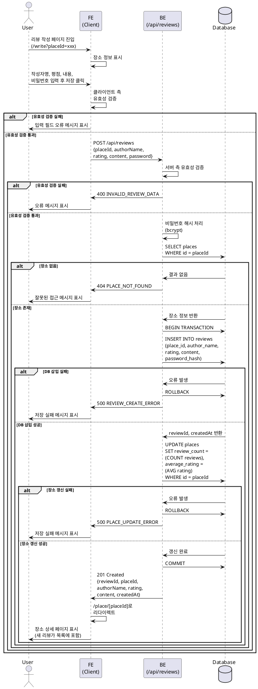

# 유스케이스 002: 신규 리뷰 작성 및 저장

## 개요

사용자가 특정 장소(음식점)에 대한 리뷰를 작성하고 저장하는 기능입니다. 회원가입 없이 비밀번호 기반의 익명 리뷰를 작성할 수 있으며, 작성된 리뷰는 데이터베이스에 저장되고 해당 장소의 평균 평점이 갱신됩니다.

## Primary Actor

- 리뷰어 (Reviewer): 특정 음식점을 방문한 후 자신의 경험을 공유하고자 하는 사용자

## Precondition

- 사용자가 리뷰를 작성하려는 장소(음식점)의 정보가 존재해야 합니다 (검색을 통해 확인된 장소)
- 사용자가 리뷰 작성 페이지(`/write?placeId=...`)에 접근 가능한 상태여야 합니다

## Trigger

- 사용자가 메인 페이지의 검색 결과 배너에서 '리뷰 작성하기' 버튼을 클릭하거나
- 장소 상세 페이지에서 '리뷰 작성하기' 버튼을 클릭하여 리뷰 작성 페이지로 진입

## Main Scenario

1. 사용자가 리뷰 작성 페이지로 진입하면, 대상 장소의 정보(가게명, 주소 등)가 상단에 표시됩니다
2. 사용자가 리뷰 작성 폼의 각 필드를 입력합니다:
   - 작성자명 (텍스트 입력)
   - 평점 (1~5점 선택)
   - 리뷰 내용 (텍스트 입력)
   - 비밀번호 (수정/삭제 시 사용할 비밀번호)
3. 사용자가 '저장' 버튼을 클릭합니다
4. 시스템이 입력된 데이터의 유효성을 검증합니다
5. 비밀번호를 안전하게 해시 처리합니다
6. 리뷰 데이터를 `reviews` 테이블에 저장합니다
7. 해당 장소의 `review_count`와 `average_rating`을 갱신합니다
8. 사용자를 해당 장소의 상세 페이지로 리다이렉트합니다
9. 작성된 리뷰가 리뷰 목록 최상단에 표시됩니다
10. (첫 리뷰인 경우) 메인 페이지 지도에 해당 장소의 마커가 생성됩니다

## Edge Cases

### 1. 입력 유효성 검증 실패

**발생 조건:**
- 필수 필드(작성자명, 평점, 리뷰 내용, 비밀번호) 중 하나 이상이 비어있음
- 비밀번호가 최소/최대 길이 요구사항을 충족하지 못함
- 평점이 1~5 범위를 벗어남

**처리:**
- 사용자는 리뷰 작성 페이지에 머무름
- 각 유효성 검증에 실패한 필드 하단에 오류 메시지를 표시
- 예시: "작성자명을 입력하세요", "비밀번호는 최소 4자 이상이어야 합니다"

### 2. 데이터베이스 저장 실패

**발생 조건:**
- 네트워크 연결 오류
- 데이터베이스 서버 오류
- 트랜잭션 실패

**처리:**
- 사용자는 리뷰 작성 페이지에 머무름
- "저장에 실패했습니다. 잠시 후 다시 시도해주세요" 메시지를 스낵바/토스트로 표시
- 서버 로그에 에러 상세 정보를 기록

### 3. 잘못된 placeId

**발생 조건:**
- URL의 `placeId` 파라미터가 없거나 유효하지 않은 UUID
- 해당 placeId에 매칭되는 장소가 데이터베이스에 존재하지 않음

**처리:**
- 400 Bad Request 응답 반환
- 사용자에게 "잘못된 접근입니다" 메시지 표시
- 메인 페이지로 리다이렉트

## Business Rules

### 1. 비밀번호 정책

- 최소 길이: 4자
- 최대 길이: 100자
- 비밀번호는 bcrypt를 사용하여 해시 처리 후 저장
- 원본 비밀번호는 절대 저장하지 않음

### 2. 평점 규칙

- 정수 1~5 사이의 값만 허용
- 평균 평점 계산 시 소수점 첫째 자리까지 표시 (반올림)

### 3. 리뷰 작성자명

- 최소 길이: 1자
- 최대 길이: 50자
- 특수문자 허용

### 4. 리뷰 내용

- 최소 길이: 1자
- 최대 길이: 1000자

### 5. 장소 정보 갱신

- 리뷰가 저장될 때마다 `places` 테이블의 다음 필드가 자동 갱신됨:
  - `review_count`: 해당 장소의 총 리뷰 개수
  - `average_rating`: 모든 리뷰 평점의 평균값
  - `updated_at`: 현재 시각

## API Specification

### Endpoint: POST /api/reviews

리뷰를 생성하는 API 엔드포인트

#### Request

**Headers:**
```
Content-Type: application/json
```

**Body Schema:**
```typescript
{
  placeId: string;        // UUID 형식
  authorName: string;     // 1~50자
  rating: number;         // 1~5 정수
  content: string;        // 1~1000자
  password: string;       // 4~100자 (해시 처리 전)
}
```

**Example:**
```json
{
  "placeId": "550e8400-e29b-41d4-a716-446655440000",
  "authorName": "맛객",
  "rating": 5,
  "content": "정말 맛있어요!",
  "password": "1234"
}
```

#### Response

**Success (201 Created):**
```typescript
{
  ok: true;
  data: {
    reviewId: string;     // 생성된 리뷰의 UUID
    placeId: string;      // 장소 UUID
    authorName: string;
    rating: number;
    content: string;
    createdAt: string;    // ISO 8601 timestamp
  }
}
```

**Example:**
```json
{
  "ok": true,
  "data": {
    "reviewId": "660e8400-e29b-41d4-a716-446655440001",
    "placeId": "550e8400-e29b-41d4-a716-446655440000",
    "authorName": "맛객",
    "rating": 5,
    "content": "정말 맛있어요!",
    "createdAt": "2025-10-21T12:34:56Z"
  }
}
```

**Error Responses:**

**400 Bad Request - 유효성 검증 실패:**
```json
{
  "ok": false,
  "status": 400,
  "error": {
    "code": "INVALID_REVIEW_DATA",
    "message": "The provided review data is invalid.",
    "details": {
      "authorName": {
        "_errors": ["Required"]
      }
    }
  }
}
```

**404 Not Found - 장소가 존재하지 않음:**
```json
{
  "ok": false,
  "status": 404,
  "error": {
    "code": "PLACE_NOT_FOUND",
    "message": "The specified place does not exist."
  }
}
```

**500 Internal Server Error - 서버 오류:**
```json
{
  "ok": false,
  "status": 500,
  "error": {
    "code": "REVIEW_CREATE_ERROR",
    "message": "Failed to create review. Please try again later."
  }
}
```

### Error Codes

| Code | HTTP Status | Description |
|------|-------------|-------------|
| `INVALID_REVIEW_DATA` | 400 | 요청 데이터의 유효성 검증 실패 |
| `PLACE_NOT_FOUND` | 404 | 지정된 placeId에 해당하는 장소가 존재하지 않음 |
| `REVIEW_CREATE_ERROR` | 500 | 리뷰 생성 중 데이터베이스 오류 발생 |
| `PASSWORD_HASH_ERROR` | 500 | 비밀번호 해시 처리 중 오류 발생 |
| `PLACE_UPDATE_ERROR` | 500 | 장소 정보 갱신 중 오류 발생 |

## Database Operations

### 1. 리뷰 생성 (INSERT)

```sql
INSERT INTO reviews (
  place_id,
  author_name,
  rating,
  content,
  password_hash
)
VALUES (
  $1,  -- placeId (UUID)
  $2,  -- authorName (VARCHAR)
  $3,  -- rating (INTEGER)
  $4,  -- content (TEXT)
  $5   -- hashedPassword (VARCHAR)
)
RETURNING id, created_at;
```

### 2. 장소 정보 갱신 (UPDATE)

```sql
UPDATE places
SET
  review_count = (
    SELECT COUNT(*)
    FROM reviews
    WHERE place_id = $1
  ),
  average_rating = (
    SELECT ROUND(AVG(rating)::numeric, 1)
    FROM reviews
    WHERE place_id = $1
  )
WHERE id = $1
RETURNING average_rating, review_count;
```

### 3. 장소 존재 확인 (SELECT)

```sql
SELECT id, name, address, category
FROM places
WHERE id = $1;
```

## Sequence Diagram



## 관련 파일 경로 (구현 시 참조)

### Frontend
- `/app/write/page.tsx` - 리뷰 작성 페이지
- `/components/review/ReviewForm.tsx` - 리뷰 작성 폼 컴포넌트

### Backend
- `/src/features/reviews/backend/route.ts` - Hono 라우터 정의
- `/src/features/reviews/backend/service.ts` - 비즈니스 로직 및 Supabase 접근
- `/src/features/reviews/backend/schema.ts` - 요청/응답 Zod 스키마 정의
- `/src/features/reviews/backend/error.ts` - 에러 코드 정의

### Database
- `/supabase/migrations/0002_create_reviews_table.sql` - reviews 테이블 마이그레이션
