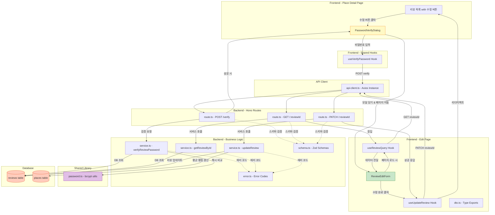

# Use Case 003 구현 계획: 기존 리뷰 수정

## 개요

본 문서는 Use Case 003 (리뷰 수정 기능)을 구현하기 위한 모듈 설계 및 구현 계획입니다. 사용자가 비밀번호 인증을 통해 자신이 작성한 리뷰를 수정할 수 있는 기능을 제공합니다.

### 주요 특징
- **2단계 플로우**: 비밀번호 인증 → 리뷰 수정
- **비밀번호 검증**: bcrypt를 사용한 안전한 비밀번호 해시 비교
- **데이터 Pre-fill**: 기존 리뷰 데이터를 수정 폼에 자동으로 채움
- **평균 평점 재계산**: 리뷰 수정 시 장소의 평균 평점 자동 갱신

---

## 모듈 목록

### Backend 모듈

#### 1. `/src/lib/crypto/password.ts`
- **설명**: 비밀번호 해시 및 검증 유틸리티 (공통 모듈)
- **역할**:
  - `hashPassword(password: string)`: bcrypt를 사용한 비밀번호 해싱
  - `verifyPassword(password: string, hash: string)`: 비밀번호 검증
  - 에러 처리 및 안전한 비교

#### 2. `/src/features/reviews/backend/schema.ts`
- **설명**: 리뷰 관련 요청/응답 스키마 정의 (Zod)
- **역할**:
  - `VerifyPasswordSchema`: 비밀번호 인증 요청 스키마 (4-100자)
  - `ReviewIdParamSchema`: reviewId 파라미터 검증 (UUID)
  - `UpdateReviewSchema`: 리뷰 수정 요청 스키마
  - `ReviewResponseSchema`: 리뷰 응답 스키마
  - `ReviewRowSchema`: DB 테이블 행 스키마

#### 3. `/src/features/reviews/backend/error.ts`
- **설명**: 리뷰 기능 관련 에러 코드 정의
- **역할**:
  - `REVIEW_NOT_FOUND`: 리뷰를 찾을 수 없음
  - `INVALID_PASSWORD`: 비밀번호 불일치
  - `REVIEW_UPDATE_ERROR`: 리뷰 수정 실패
  - `PLACE_UPDATE_ERROR`: 장소 평균 평점 갱신 실패
  - `PASSWORD_VERIFICATION_ERROR`: 비밀번호 검증 중 오류

#### 4. `/src/features/reviews/backend/service.ts`
- **설명**: 리뷰 비즈니스 로직 처리
- **역할**:
  - `verifyReviewPassword()`: 비밀번호 인증
  - `getReviewById()`: 리뷰 조회
  - `updateReview()`: 리뷰 수정 및 평균 평점 재계산
  - Supabase 트랜잭션 처리

#### 5. `/src/features/reviews/backend/route.ts`
- **설명**: Hono 기반 리뷰 API 라우터
- **역할**:
  - `POST /api/reviews/:reviewId/verify`: 비밀번호 인증
  - `GET /api/reviews/:reviewId`: 리뷰 조회
  - `PATCH /api/reviews/:reviewId`: 리뷰 수정
  - 요청 검증 및 응답 반환

### Frontend 모듈

#### 6. `/src/features/reviews/lib/dto.ts`
- **설명**: 백엔드 스키마 재노출 (프론트엔드용)
- **역할**:
  - `ReviewResponse`, `UpdateReviewRequest` 타입 재노출
  - React Query 훅에서 사용

#### 7. `/src/features/reviews/hooks/useVerifyPassword.ts`
- **설명**: 비밀번호 인증 React Query Mutation 훅
- **역할**:
  - `useVerifyPassword(reviewId)` 훅 제공
  - API 호출 및 에러 처리
  - 성공 시 콜백 실행

#### 8. `/src/features/reviews/hooks/useReviewQuery.ts`
- **설명**: 리뷰 조회 React Query 훅
- **역할**:
  - `useReviewQuery(reviewId)` 훅 제공
  - 리뷰 데이터 캐싱
  - 에러 처리

#### 9. `/src/features/reviews/hooks/useUpdateReview.ts`
- **설명**: 리뷰 수정 React Query Mutation 훅
- **역할**:
  - `useUpdateReview(reviewId)` 훅 제공
  - API 호출 및 에러 처리
  - 성공 시 장소 상세 페이지로 리다이렉트

#### 10. `/src/features/reviews/components/password-verify-dialog.tsx`
- **설명**: 비밀번호 확인 모달 컴포넌트
- **역할**:
  - 비밀번호 입력 UI
  - 유효성 검증 메시지 표시
  - 인증 성공 시 모달 닫기 및 수정 페이지 이동

#### 11. `/src/features/reviews/components/review-edit-form.tsx`
- **설명**: 리뷰 수정 폼 컴포넌트
- **역할**:
  - react-hook-form 기반 폼 구현
  - 기존 데이터 pre-fill
  - 작성자명, 평점, 내용 수정
  - 유효성 검증 및 제출

#### 12. `/src/app/edit/[reviewId]/page.tsx`
- **설명**: 리뷰 수정 페이지
- **역할**:
  - 리뷰 데이터 로드 및 폼 렌더링
  - 로딩/에러 상태 처리
  - 수정 완료 후 리다이렉트

### 통합 모듈

#### 13. `/src/backend/hono/app.ts` (수정)
- **설명**: Hono 앱에 리뷰 라우터 등록
- **역할**:
  - `registerReviewRoutes(app)` 호출 추가

#### 14. `/src/app/place/[placeId]/page.tsx` (수정)
- **설명**: 장소 상세 페이지에서 '수정' 버튼 추가
- **역할**:
  - 리뷰 목록 각 항목에 '수정' 버튼 렌더링
  - 비밀번호 확인 모달 트리거

---

## 모듈 관계 다이어그램



---

## 구현 계획

### Phase 1: 공통 모듈 구현

#### 1.1. `/src/lib/crypto/password.ts`

**목적**: 비밀번호 해시 및 검증을 위한 공통 유틸리티 제공

**구현 내용**:
```typescript
import bcrypt from 'bcryptjs';

/**
 * 비밀번호 해시 처리
 * @param password 평문 비밀번호
 * @returns 해시된 비밀번호
 */
export const hashPassword = async (password: string): Promise<string> => {
  try {
    const saltRounds = 10;
    const hash = await bcrypt.hash(password, saltRounds);
    return hash;
  } catch (error) {
    throw new Error('Failed to hash password');
  }
};

/**
 * 비밀번호 검증
 * @param password 평문 비밀번호
 * @param hash 저장된 해시값
 * @returns 일치 여부
 */
export const verifyPassword = async (
  password: string,
  hash: string,
): Promise<boolean> => {
  try {
    const isMatch = await bcrypt.compare(password, hash);
    return isMatch;
  } catch (error) {
    throw new Error('Failed to verify password');
  }
};
```

**의존성 설치**:
```bash
npm install bcryptjs
npm install --save-dev @types/bcryptjs
```

**단위 테스트 시나리오** (`password.test.ts`):
- ✅ `hashPassword` 호출 시 원본과 다른 해시값 반환
- ✅ `verifyPassword` 올바른 비밀번호로 검증 시 `true` 반환
- ✅ `verifyPassword` 잘못된 비밀번호로 검증 시 `false` 반환
- ✅ 동일한 비밀번호를 두 번 해시 시 서로 다른 해시값 생성 (salt 랜덤)

---

### Phase 2: Backend 모듈 구현

#### 2.1. `/src/features/reviews/backend/schema.ts`

```typescript
import { z } from 'zod';

// reviewId 파라미터 스키마
export const ReviewIdParamSchema = z.object({
  reviewId: z.string().uuid({ message: 'Review ID must be a valid UUID.' }),
});

export type ReviewIdParam = z.infer<typeof ReviewIdParamSchema>;

// 비밀번호 인증 요청 스키마
export const VerifyPasswordSchema = z.object({
  password: z
    .string()
    .min(4, { message: '비밀번호는 최소 4자 이상이어야 합니다.' })
    .max(100, { message: '비밀번호는 최대 100자까지 입력 가능합니다.' }),
});

export type VerifyPasswordRequest = z.infer<typeof VerifyPasswordSchema>;

// 리뷰 수정 요청 스키마
export const UpdateReviewSchema = z.object({
  authorName: z
    .string()
    .min(1, { message: '작성자명을 입력하세요.' })
    .max(50, { message: '작성자명은 최대 50자까지 입력 가능합니다.' }),
  rating: z
    .number()
    .int({ message: '평점은 정수여야 합니다.' })
    .min(1, { message: '평점은 최소 1점입니다.' })
    .max(5, { message: '평점은 최대 5점입니다.' }),
  content: z
    .string()
    .min(1, { message: '리뷰 내용을 입력하세요.' })
    .max(1000, { message: '리뷰 내용은 최대 1000자까지 입력 가능합니다.' }),
});

export type UpdateReviewRequest = z.infer<typeof UpdateReviewSchema>;

// 리뷰 응답 스키마
export const ReviewResponseSchema = z.object({
  id: z.string().uuid(),
  placeId: z.string().uuid(),
  authorName: z.string(),
  rating: z.number().int().min(1).max(5),
  content: z.string(),
  createdAt: z.string(),
  updatedAt: z.string(),
});

export type ReviewResponse = z.infer<typeof ReviewResponseSchema>;

// DB 테이블 행 스키마
export const ReviewRowSchema = z.object({
  id: z.string().uuid(),
  place_id: z.string().uuid(),
  author_name: z.string(),
  rating: z.number().int(),
  content: z.string(),
  password_hash: z.string(),
  created_at: z.string(),
  updated_at: z.string(),
});

export type ReviewRow = z.infer<typeof ReviewRowSchema>;
```

#### 2.2. `/src/features/reviews/backend/error.ts`

```typescript
export const reviewErrorCodes = {
  notFound: 'REVIEW_NOT_FOUND',
  invalidPassword: 'INVALID_PASSWORD',
  updateError: 'REVIEW_UPDATE_ERROR',
  placeUpdateError: 'PLACE_UPDATE_ERROR',
  verificationError: 'PASSWORD_VERIFICATION_ERROR',
  fetchError: 'REVIEW_FETCH_ERROR',
  validationError: 'REVIEW_VALIDATION_ERROR',
} as const;

type ReviewErrorValue = (typeof reviewErrorCodes)[keyof typeof reviewErrorCodes];

export type ReviewServiceError = ReviewErrorValue;
```

#### 2.3. `/src/features/reviews/backend/service.ts`

```typescript
import type { SupabaseClient } from '@supabase/supabase-js';
import {
  failure,
  success,
  type HandlerResult,
} from '@/backend/http/response';
import { verifyPassword } from '@/lib/crypto/password';
import {
  ReviewResponseSchema,
  ReviewRowSchema,
  type ReviewResponse,
  type ReviewRow,
  type UpdateReviewRequest,
} from '@/features/reviews/backend/schema';
import {
  reviewErrorCodes,
  type ReviewServiceError,
} from '@/features/reviews/backend/error';

const REVIEWS_TABLE = 'reviews';
const PLACES_TABLE = 'places';

/**
 * 비밀번호 인증
 */
export const verifyReviewPassword = async (
  client: SupabaseClient,
  reviewId: string,
  password: string,
): Promise<HandlerResult<{ verified: true }, ReviewServiceError, unknown>> => {
  // 리뷰의 password_hash 조회
  const { data, error } = await client
    .from(REVIEWS_TABLE)
    .select('password_hash')
    .eq('id', reviewId)
    .maybeSingle<{ password_hash: string }>();

  if (error) {
    return failure(500, reviewErrorCodes.fetchError, error.message);
  }

  if (!data) {
    return failure(404, reviewErrorCodes.notFound, '리뷰를 찾을 수 없습니다');
  }

  // 비밀번호 검증
  try {
    const isValid = await verifyPassword(password, data.password_hash);

    if (!isValid) {
      return failure(
        401,
        reviewErrorCodes.invalidPassword,
        '비밀번호가 일치하지 않습니다',
      );
    }

    return success({ verified: true });
  } catch (error) {
    return failure(
      500,
      reviewErrorCodes.verificationError,
      '비밀번호 검증 중 오류가 발생했습니다',
      error instanceof Error ? error.message : String(error),
    );
  }
};

/**
 * 리뷰 조회
 */
export const getReviewById = async (
  client: SupabaseClient,
  reviewId: string,
): Promise<HandlerResult<ReviewResponse, ReviewServiceError, unknown>> => {
  const { data, error } = await client
    .from(REVIEWS_TABLE)
    .select('id, place_id, author_name, rating, content, created_at, updated_at')
    .eq('id', reviewId)
    .maybeSingle<Omit<ReviewRow, 'password_hash'>>();

  if (error) {
    return failure(500, reviewErrorCodes.fetchError, error.message);
  }

  if (!data) {
    return failure(404, reviewErrorCodes.notFound, '리뷰를 찾을 수 없습니다');
  }

  // 응답 포맷 변환 (snake_case → camelCase)
  const mapped = {
    id: data.id,
    placeId: data.place_id,
    authorName: data.author_name,
    rating: data.rating,
    content: data.content,
    createdAt: data.created_at,
    updatedAt: data.updated_at,
  } satisfies ReviewResponse;

  const parsed = ReviewResponseSchema.safeParse(mapped);

  if (!parsed.success) {
    return failure(
      500,
      reviewErrorCodes.validationError,
      'Review payload failed validation.',
      parsed.error.format(),
    );
  }

  return success(parsed.data);
};

/**
 * 리뷰 수정 및 장소 평균 평점 재계산
 */
export const updateReview = async (
  client: SupabaseClient,
  reviewId: string,
  updateData: UpdateReviewRequest,
): Promise<HandlerResult<ReviewResponse, ReviewServiceError, unknown>> => {
  // 리뷰 업데이트 (updated_at은 트리거로 자동 갱신)
  const { data: updatedReview, error: updateError } = await client
    .from(REVIEWS_TABLE)
    .update({
      author_name: updateData.authorName,
      rating: updateData.rating,
      content: updateData.content,
    })
    .eq('id', reviewId)
    .select('id, place_id, author_name, rating, content, created_at, updated_at')
    .single<Omit<ReviewRow, 'password_hash'>>();

  if (updateError || !updatedReview) {
    return failure(
      500,
      reviewErrorCodes.updateError,
      '리뷰 수정에 실패했습니다',
      updateError?.message,
    );
  }

  // 장소의 평균 평점 재계산
  const placeId = updatedReview.place_id;

  const { error: placeUpdateError } = await client.rpc('update_place_rating', {
    p_place_id: placeId,
  });

  if (placeUpdateError) {
    // 평균 평점 갱신 실패 시에도 리뷰 수정은 완료되었으므로 warning 로깅만 수행
    // (실패 시 별도 복구 로직 필요)
    console.warn(
      `Failed to update average rating for place ${placeId}:`,
      placeUpdateError.message,
    );
  }

  // 응답 포맷 변환
  const mapped = {
    id: updatedReview.id,
    placeId: updatedReview.place_id,
    authorName: updatedReview.author_name,
    rating: updatedReview.rating,
    content: updatedReview.content,
    createdAt: updatedReview.created_at,
    updatedAt: updatedReview.updated_at,
  } satisfies ReviewResponse;

  const parsed = ReviewResponseSchema.safeParse(mapped);

  if (!parsed.success) {
    return failure(
      500,
      reviewErrorCodes.validationError,
      'Updated review payload failed validation.',
      parsed.error.format(),
    );
  }

  return success(parsed.data);
};
```

**단위 테스트 시나리오** (`service.test.ts`):
- ✅ `verifyReviewPassword`: 올바른 비밀번호 입력 시 `{ verified: true }` 반환
- ✅ `verifyReviewPassword`: 잘못된 비밀번호 입력 시 `INVALID_PASSWORD` 반환
- ✅ `verifyReviewPassword`: 존재하지 않는 reviewId 시 `REVIEW_NOT_FOUND` 반환
- ✅ `getReviewById`: 정상 조회 시 리뷰 데이터 반환
- ✅ `getReviewById`: 존재하지 않는 reviewId 시 `REVIEW_NOT_FOUND` 반환
- ✅ `updateReview`: 정상 수정 시 업데이트된 리뷰 반환
- ✅ `updateReview`: DB 업데이트 실패 시 `REVIEW_UPDATE_ERROR` 반환

#### 2.4. `/src/features/reviews/backend/route.ts`

```typescript
import type { Hono } from 'hono';
import {
  failure,
  respond,
  type ErrorResult,
} from '@/backend/http/response';
import {
  getLogger,
  getSupabase,
  type AppEnv,
} from '@/backend/hono/context';
import {
  ReviewIdParamSchema,
  VerifyPasswordSchema,
  UpdateReviewSchema,
} from '@/features/reviews/backend/schema';
import {
  verifyReviewPassword,
  getReviewById,
  updateReview,
} from './service';
import {
  reviewErrorCodes,
  type ReviewServiceError,
} from './error';

export const registerReviewRoutes = (app: Hono<AppEnv>) => {
  // POST /api/reviews/:reviewId/verify - 비밀번호 인증
  app.post('/reviews/:reviewId/verify', async (c) => {
    const parsedParams = ReviewIdParamSchema.safeParse({
      reviewId: c.req.param('reviewId'),
    });

    if (!parsedParams.success) {
      return respond(
        c,
        failure(
          400,
          'INVALID_REVIEW_ID',
          'The provided review ID is invalid.',
          parsedParams.error.format(),
        ),
      );
    }

    const body = await c.req.json();
    const parsedBody = VerifyPasswordSchema.safeParse(body);

    if (!parsedBody.success) {
      return respond(
        c,
        failure(
          400,
          'INVALID_PASSWORD_REQUEST',
          'The provided password is invalid.',
          parsedBody.error.format(),
        ),
      );
    }

    const supabase = getSupabase(c);
    const logger = getLogger(c);

    const result = await verifyReviewPassword(
      supabase,
      parsedParams.data.reviewId,
      parsedBody.data.password,
    );

    if (!result.ok) {
      const errorResult = result as ErrorResult<ReviewServiceError, unknown>;

      if (errorResult.error.code === reviewErrorCodes.invalidPassword) {
        logger.warn(`Invalid password attempt for review ${parsedParams.data.reviewId}`);
      } else if (errorResult.error.code === reviewErrorCodes.notFound) {
        logger.warn(`Review not found: ${parsedParams.data.reviewId}`);
      } else {
        logger.error('Password verification error', errorResult.error);
      }
    } else {
      logger.info(`Password verified for review ${parsedParams.data.reviewId}`);
    }

    return respond(c, result);
  });

  // GET /api/reviews/:reviewId - 리뷰 조회
  app.get('/reviews/:reviewId', async (c) => {
    const parsedParams = ReviewIdParamSchema.safeParse({
      reviewId: c.req.param('reviewId'),
    });

    if (!parsedParams.success) {
      return respond(
        c,
        failure(
          400,
          'INVALID_REVIEW_ID',
          'The provided review ID is invalid.',
          parsedParams.error.format(),
        ),
      );
    }

    const supabase = getSupabase(c);
    const logger = getLogger(c);

    const result = await getReviewById(supabase, parsedParams.data.reviewId);

    if (!result.ok) {
      const errorResult = result as ErrorResult<ReviewServiceError, unknown>;

      if (errorResult.error.code === reviewErrorCodes.notFound) {
        logger.warn(`Review not found: ${parsedParams.data.reviewId}`);
      } else {
        logger.error('Failed to fetch review', errorResult.error);
      }
    }

    return respond(c, result);
  });

  // PATCH /api/reviews/:reviewId - 리뷰 수정
  app.patch('/reviews/:reviewId', async (c) => {
    const parsedParams = ReviewIdParamSchema.safeParse({
      reviewId: c.req.param('reviewId'),
    });

    if (!parsedParams.success) {
      return respond(
        c,
        failure(
          400,
          'INVALID_REVIEW_ID',
          'The provided review ID is invalid.',
          parsedParams.error.format(),
        ),
      );
    }

    const body = await c.req.json();
    const parsedBody = UpdateReviewSchema.safeParse(body);

    if (!parsedBody.success) {
      return respond(
        c,
        failure(
          400,
          'INVALID_UPDATE_REQUEST',
          'The provided update data is invalid.',
          parsedBody.error.format(),
        ),
      );
    }

    const supabase = getSupabase(c);
    const logger = getLogger(c);

    const result = await updateReview(
      supabase,
      parsedParams.data.reviewId,
      parsedBody.data,
    );

    if (!result.ok) {
      const errorResult = result as ErrorResult<ReviewServiceError, unknown>;

      if (errorResult.error.code === reviewErrorCodes.updateError) {
        logger.error('Failed to update review', errorResult.error);
      } else if (errorResult.error.code === reviewErrorCodes.notFound) {
        logger.warn(`Review not found: ${parsedParams.data.reviewId}`);
      }
    } else {
      logger.info(`Review updated: ${parsedParams.data.reviewId}`);
    }

    return respond(c, result);
  });
};
```

#### 2.5. `/src/backend/hono/app.ts` 수정

```typescript
import { Hono } from 'hono';
import { errorBoundary } from '@/backend/middleware/error';
import { withAppContext } from '@/backend/middleware/context';
import { withSupabase } from '@/backend/middleware/supabase';
import { registerExampleRoutes } from '@/features/example/backend/route';
import { registerReviewRoutes } from '@/features/reviews/backend/route'; // 추가
import type { AppEnv } from '@/backend/hono/context';

let singletonApp: Hono<AppEnv> | null = null;

export const createHonoApp = () => {
  if (singletonApp) {
    return singletonApp;
  }

  const app = new Hono<AppEnv>();

  app.use('*', errorBoundary());
  app.use('*', withAppContext());
  app.use('*', withSupabase());

  registerExampleRoutes(app);
  registerReviewRoutes(app); // 추가

  singletonApp = app;

  return app;
};
```

---

### Phase 3: 데이터베이스 함수 추가

#### 3.1. `/supabase/migrations/0006_create_update_place_rating_function.sql`

**목적**: 장소 평균 평점을 재계산하는 PostgreSQL 함수 생성

```sql
-- 평균 평점 재계산 함수
CREATE OR REPLACE FUNCTION update_place_rating(p_place_id UUID)
RETURNS VOID AS $$
BEGIN
  UPDATE places
  SET average_rating = (
    SELECT COALESCE(ROUND(AVG(rating)::numeric, 1), 0.0)
    FROM reviews
    WHERE place_id = p_place_id
  )
  WHERE id = p_place_id;
END;
$$ LANGUAGE plpgsql;

COMMENT ON FUNCTION update_place_rating IS '특정 장소의 평균 평점을 재계산하는 함수';
```

**적용 방법**:
사용자가 직접 Supabase Dashboard에서 실행하거나 CLI를 통해 적용합니다.

---

### Phase 4: Frontend 모듈 구현

#### 4.1. `/src/features/reviews/lib/dto.ts`

```typescript
export {
  ReviewIdParamSchema,
  VerifyPasswordSchema,
  UpdateReviewSchema,
  ReviewResponseSchema,
  type ReviewIdParam,
  type VerifyPasswordRequest,
  type UpdateReviewRequest,
  type ReviewResponse,
} from '@/features/reviews/backend/schema';
```

#### 4.2. `/src/features/reviews/hooks/useVerifyPassword.ts`

```typescript
'use client';

import { useMutation } from '@tanstack/react-query';
import { apiClient, extractApiErrorMessage } from '@/lib/remote/api-client';
import type { VerifyPasswordRequest } from '@/features/reviews/lib/dto';

const verifyPassword = async (
  reviewId: string,
  data: VerifyPasswordRequest,
): Promise<{ verified: true }> => {
  try {
    const response = await apiClient.post(
      `/api/reviews/${reviewId}/verify`,
      data,
    );
    return response.data;
  } catch (error) {
    const message = extractApiErrorMessage(
      error,
      '비밀번호 인증 중 오류가 발생했습니다.',
    );
    throw new Error(message);
  }
};

export const useVerifyPassword = (reviewId: string) => {
  return useMutation({
    mutationFn: (data: VerifyPasswordRequest) => verifyPassword(reviewId, data),
    retry: false, // 비밀번호 인증은 재시도하지 않음
  });
};
```

#### 4.3. `/src/features/reviews/hooks/useReviewQuery.ts`

```typescript
'use client';

import { useQuery } from '@tanstack/react-query';
import { apiClient, extractApiErrorMessage } from '@/lib/remote/api-client';
import { ReviewResponseSchema, type ReviewResponse } from '@/features/reviews/lib/dto';

const fetchReview = async (reviewId: string): Promise<ReviewResponse> => {
  try {
    const { data } = await apiClient.get(`/api/reviews/${reviewId}`);

    const parsed = ReviewResponseSchema.parse(data);
    return parsed;
  } catch (error) {
    const message = extractApiErrorMessage(error, '리뷰를 불러오는 중 오류가 발생했습니다.');
    throw new Error(message);
  }
};

export const useReviewQuery = (reviewId: string) => {
  return useQuery({
    queryKey: ['review', reviewId],
    queryFn: () => fetchReview(reviewId),
    enabled: Boolean(reviewId),
    staleTime: 0, // 항상 최신 데이터 조회
    retry: 1,
  });
};
```

#### 4.4. `/src/features/reviews/hooks/useUpdateReview.ts`

```typescript
'use client';

import { useMutation } from '@tanstack/react-query';
import { apiClient, extractApiErrorMessage } from '@/lib/remote/api-client';
import type { UpdateReviewRequest, ReviewResponse } from '@/features/reviews/lib/dto';

const updateReview = async (
  reviewId: string,
  data: UpdateReviewRequest,
): Promise<ReviewResponse> => {
  try {
    const response = await apiClient.patch(`/api/reviews/${reviewId}`, data);
    return response.data;
  } catch (error) {
    const message = extractApiErrorMessage(
      error,
      '리뷰 수정 중 오류가 발생했습니다.',
    );
    throw new Error(message);
  }
};

export const useUpdateReview = (reviewId: string) => {
  return useMutation({
    mutationFn: (data: UpdateReviewRequest) => updateReview(reviewId, data),
    retry: 1,
  });
};
```

#### 4.5. `/src/features/reviews/components/password-verify-dialog.tsx`

```typescript
'use client';

import { useState } from 'react';
import { useRouter } from 'next/navigation';
import { useForm } from 'react-hook-form';
import { zodResolver } from '@hookform/resolvers/zod';
import {
  Dialog,
  DialogContent,
  DialogHeader,
  DialogTitle,
  DialogDescription,
} from '@/components/ui/dialog';
import { Input } from '@/components/ui/input';
import { Button } from '@/components/ui/button';
import { Label } from '@/components/ui/label';
import { useVerifyPassword } from '@/features/reviews/hooks/useVerifyPassword';
import { VerifyPasswordSchema, type VerifyPasswordRequest } from '@/features/reviews/lib/dto';

interface PasswordVerifyDialogProps {
  reviewId: string;
  open: boolean;
  onOpenChange: (open: boolean) => void;
}

export const PasswordVerifyDialog = ({
  reviewId,
  open,
  onOpenChange,
}: PasswordVerifyDialogProps) => {
  const router = useRouter();
  const [errorMessage, setErrorMessage] = useState<string | null>(null);

  const {
    register,
    handleSubmit,
    formState: { errors },
    reset,
  } = useForm<VerifyPasswordRequest>({
    resolver: zodResolver(VerifyPasswordSchema),
  });

  const verifyMutation = useVerifyPassword(reviewId);

  const onSubmit = async (data: VerifyPasswordRequest) => {
    setErrorMessage(null);

    try {
      await verifyMutation.mutateAsync(data);

      // 인증 성공 시 수정 페이지로 이동
      onOpenChange(false);
      reset();
      router.push(`/edit/${reviewId}`);
    } catch (error) {
      setErrorMessage(error instanceof Error ? error.message : '인증에 실패했습니다');
    }
  };

  const handleClose = () => {
    onOpenChange(false);
    reset();
    setErrorMessage(null);
  };

  return (
    <Dialog open={open} onOpenChange={handleClose}>
      <DialogContent>
        <DialogHeader>
          <DialogTitle>비밀번호 확인</DialogTitle>
          <DialogDescription>
            리뷰를 수정하려면 작성 시 설정한 비밀번호를 입력하세요.
          </DialogDescription>
        </DialogHeader>

        <form onSubmit={handleSubmit(onSubmit)} className="space-y-4">
          <div className="space-y-2">
            <Label htmlFor="password">비밀번호</Label>
            <Input
              id="password"
              type="password"
              placeholder="비밀번호를 입력하세요"
              {...register('password')}
              aria-invalid={Boolean(errors.password)}
              aria-describedby={errors.password ? 'password-error' : undefined}
            />
            {errors.password && (
              <p id="password-error" className="text-sm text-red-600" role="alert">
                {errors.password.message}
              </p>
            )}
            {errorMessage && (
              <p className="text-sm text-red-600" role="alert">
                {errorMessage}
              </p>
            )}
          </div>

          <div className="flex gap-2 justify-end">
            <Button type="button" variant="outline" onClick={handleClose}>
              취소
            </Button>
            <Button type="submit" disabled={verifyMutation.isPending}>
              {verifyMutation.isPending ? '확인 중...' : '확인'}
            </Button>
          </div>
        </form>
      </DialogContent>
    </Dialog>
  );
};
```

**QA Sheet** (`password-verify-dialog.qa.md`):
- ✅ 비밀번호 입력 후 '확인' 버튼 클릭 시 인증 요청
- ✅ 비밀번호 미입력 시 "비밀번호는 최소 4자 이상이어야 합니다." 메시지 표시
- ✅ 비밀번호 불일치 시 "비밀번호가 일치하지 않습니다" 메시지 표시
- ✅ 인증 성공 시 모달 닫히고 `/edit/[reviewId]` 페이지로 이동
- ✅ '취소' 버튼 클릭 시 모달 닫히고 입력 필드 초기화
- ✅ 인증 중일 때 버튼에 "확인 중..." 표시

#### 4.6. `/src/features/reviews/components/review-edit-form.tsx`

```typescript
'use client';

import { useEffect } from 'react';
import { useRouter } from 'next/navigation';
import { useForm } from 'react-hook-form';
import { zodResolver } from '@hookform/resolvers/zod';
import { Button } from '@/components/ui/button';
import { Input } from '@/components/ui/input';
import { Textarea } from '@/components/ui/textarea';
import { Label } from '@/components/ui/label';
import {
  Select,
  SelectContent,
  SelectItem,
  SelectTrigger,
  SelectValue,
} from '@/components/ui/select';
import { useUpdateReview } from '@/features/reviews/hooks/useUpdateReview';
import { UpdateReviewSchema, type UpdateReviewRequest, type ReviewResponse } from '@/features/reviews/lib/dto';
import { useToast } from '@/hooks/use-toast';

interface ReviewEditFormProps {
  reviewId: string;
  initialData: ReviewResponse;
}

export const ReviewEditForm = ({ reviewId, initialData }: ReviewEditFormProps) => {
  const router = useRouter();
  const { toast } = useToast();

  const {
    register,
    handleSubmit,
    setValue,
    watch,
    formState: { errors },
  } = useForm<UpdateReviewRequest>({
    resolver: zodResolver(UpdateReviewSchema),
    defaultValues: {
      authorName: initialData.authorName,
      rating: initialData.rating,
      content: initialData.content,
    },
  });

  const updateMutation = useUpdateReview(reviewId);
  const ratingValue = watch('rating');

  const onSubmit = async (data: UpdateReviewRequest) => {
    try {
      await updateMutation.mutateAsync(data);

      toast({
        title: '수정 완료',
        description: '리뷰가 성공적으로 수정되었습니다.',
      });

      // 장소 상세 페이지로 리다이렉트
      router.push(`/place/${initialData.placeId}`);
    } catch (error) {
      toast({
        variant: 'destructive',
        title: '수정 실패',
        description: error instanceof Error ? error.message : '리뷰 수정에 실패했습니다.',
      });
    }
  };

  return (
    <form onSubmit={handleSubmit(onSubmit)} className="space-y-6">
      {/* 작성자명 */}
      <div className="space-y-2">
        <Label htmlFor="authorName">작성자명</Label>
        <Input
          id="authorName"
          type="text"
          placeholder="작성자명을 입력하세요"
          {...register('authorName')}
          aria-invalid={Boolean(errors.authorName)}
          aria-describedby={errors.authorName ? 'authorName-error' : undefined}
        />
        {errors.authorName && (
          <p id="authorName-error" className="text-sm text-red-600" role="alert">
            {errors.authorName.message}
          </p>
        )}
      </div>

      {/* 평점 */}
      <div className="space-y-2">
        <Label htmlFor="rating">평점</Label>
        <Select
          value={String(ratingValue)}
          onValueChange={(value) => setValue('rating', parseInt(value, 10))}
        >
          <SelectTrigger id="rating" aria-label="평점 선택">
            <SelectValue placeholder="평점을 선택하세요" />
          </SelectTrigger>
          <SelectContent>
            {[1, 2, 3, 4, 5].map((star) => (
              <SelectItem key={star} value={String(star)}>
                {'★'.repeat(star)} {star}점
              </SelectItem>
            ))}
          </SelectContent>
        </Select>
        {errors.rating && (
          <p className="text-sm text-red-600" role="alert">
            {errors.rating.message}
          </p>
        )}
      </div>

      {/* 리뷰 내용 */}
      <div className="space-y-2">
        <Label htmlFor="content">리뷰 내용</Label>
        <Textarea
          id="content"
          placeholder="리뷰 내용을 입력하세요"
          rows={6}
          {...register('content')}
          aria-invalid={Boolean(errors.content)}
          aria-describedby={errors.content ? 'content-error' : undefined}
        />
        {errors.content && (
          <p id="content-error" className="text-sm text-red-600" role="alert">
            {errors.content.message}
          </p>
        )}
      </div>

      {/* 버튼 */}
      <div className="flex gap-2 justify-end">
        <Button
          type="button"
          variant="outline"
          onClick={() => router.push(`/place/${initialData.placeId}`)}
        >
          취소
        </Button>
        <Button type="submit" disabled={updateMutation.isPending}>
          {updateMutation.isPending ? '수정 중...' : '수정 완료'}
        </Button>
      </div>
    </form>
  );
};
```

**QA Sheet** (`review-edit-form.qa.md`):
- ✅ 폼 로드 시 기존 리뷰 데이터가 자동으로 입력됨
- ✅ 작성자명 미입력 시 "작성자명을 입력하세요" 메시지 표시
- ✅ 평점 선택 안 함 시 "평점은 최소 1점입니다" 메시지 표시
- ✅ 리뷰 내용 미입력 시 "리뷰 내용을 입력하세요" 메시지 표시
- ✅ '수정 완료' 버튼 클릭 시 API 호출 및 성공 토스트 표시
- ✅ 수정 성공 시 장소 상세 페이지(`/place/[placeId]`)로 리다이렉트
- ✅ '취소' 버튼 클릭 시 장소 상세 페이지로 이동
- ✅ 수정 중일 때 버튼에 "수정 중..." 표시

#### 4.7. `/src/app/edit/[reviewId]/page.tsx`

```typescript
'use client';

import { use } from 'react';
import { useReviewQuery } from '@/features/reviews/hooks/useReviewQuery';
import { ReviewEditForm } from '@/features/reviews/components/review-edit-form';
import { Alert, AlertTitle, AlertDescription } from '@/components/ui/alert';
import { AlertCircle } from 'lucide-react';

interface EditPageProps {
  params: Promise<{ reviewId: string }>;
}

export default function EditPage({ params }: EditPageProps) {
  const { reviewId } = use(params);

  const { data: review, error, isLoading } = useReviewQuery(reviewId);

  if (isLoading) {
    return (
      <div className="container mx-auto p-6">
        <p className="text-muted-foreground">리뷰 데이터를 불러오는 중...</p>
      </div>
    );
  }

  if (error || !review) {
    return (
      <div className="container mx-auto p-6">
        <Alert variant="destructive" role="alert">
          <AlertCircle className="h-4 w-4" />
          <AlertTitle>오류 발생</AlertTitle>
          <AlertDescription>
            {error instanceof Error ? error.message : '리뷰를 불러올 수 없습니다.'}
          </AlertDescription>
        </Alert>
      </div>
    );
  }

  return (
    <div className="container mx-auto p-6 max-w-2xl">
      <h1 className="text-3xl font-bold mb-6">리뷰 수정</h1>
      <ReviewEditForm reviewId={reviewId} initialData={review} />
    </div>
  );
}
```

**QA Sheet** (`edit-page.qa.md`):
- ✅ 페이지 로드 시 리뷰 데이터 조회 및 폼 렌더링
- ✅ 로딩 중일 때 "리뷰 데이터를 불러오는 중..." 메시지 표시
- ✅ 리뷰 조회 실패 시 오류 메시지 표시
- ✅ 리뷰가 존재하지 않을 때 "리뷰를 불러올 수 없습니다" 표시
- ✅ 폼에 기존 데이터가 정확히 pre-fill됨

---

### Phase 5: 장소 상세 페이지 수정 버튼 추가

#### 5.1. `/src/app/place/[placeId]/page.tsx` (수정)

장소 상세 페이지의 리뷰 목록 각 항목에 '수정' 버튼을 추가합니다.

```typescript
'use client';

import { use, useState } from 'react';
import { PasswordVerifyDialog } from '@/features/reviews/components/password-verify-dialog';
import { Button } from '@/components/ui/button';
import { Card, CardContent, CardHeader, CardTitle } from '@/components/ui/card';
// ... 기타 imports

interface PlaceDetailPageProps {
  params: Promise<{ placeId: string }>;
}

export default function PlaceDetailPage({ params }: PlaceDetailPageProps) {
  const { placeId } = use(params);
  const [selectedReviewId, setSelectedReviewId] = useState<string | null>(null);
  const [isPasswordDialogOpen, setIsPasswordDialogOpen] = useState(false);

  // ... 장소 및 리뷰 목록 조회 로직

  const handleEditClick = (reviewId: string) => {
    setSelectedReviewId(reviewId);
    setIsPasswordDialogOpen(true);
  };

  return (
    <div className="container mx-auto p-6">
      {/* 장소 정보 표시 */}
      {/* ... */}

      {/* 리뷰 목록 */}
      <div className="space-y-4">
        <h2 className="text-2xl font-bold">리뷰 목록</h2>
        {reviews.map((review) => (
          <Card key={review.id}>
            <CardHeader>
              <CardTitle>{review.authorName}</CardTitle>
              <p className="text-sm text-muted-foreground">
                {'★'.repeat(review.rating)} {review.rating}점
              </p>
            </CardHeader>
            <CardContent>
              <p>{review.content}</p>
              <div className="flex gap-2 mt-4">
                <Button
                  size="sm"
                  variant="outline"
                  onClick={() => handleEditClick(review.id)}
                >
                  수정
                </Button>
                {/* 삭제 버튼 (UC-004에서 구현) */}
              </div>
            </CardContent>
          </Card>
        ))}
      </div>

      {/* 비밀번호 확인 모달 */}
      {selectedReviewId && (
        <PasswordVerifyDialog
          reviewId={selectedReviewId}
          open={isPasswordDialogOpen}
          onOpenChange={setIsPasswordDialogOpen}
        />
      )}
    </div>
  );
}
```

**QA Sheet** (`place-detail-page.qa.md`):
- ✅ 리뷰 목록의 각 항목에 '수정' 버튼 표시
- ✅ '수정' 버튼 클릭 시 비밀번호 확인 모달 열림
- ✅ 모달에서 올바른 reviewId가 전달됨

---

## 환경 변수 설정

추가 환경 변수는 필요하지 않습니다. 기존 Supabase 설정을 사용합니다.

---

## 테스트 계획

### 단위 테스트

1. **`password.test.ts`**: bcrypt 해시 및 검증 유틸리티 테스트
2. **`service.test.ts`**: 리뷰 서비스 로직 테스트
   - `verifyReviewPassword`: 비밀번호 인증
   - `getReviewById`: 리뷰 조회
   - `updateReview`: 리뷰 수정 및 평균 평점 갱신

### 통합 테스트

1. **API 엔드포인트 테스트**:
   - `POST /api/reviews/:reviewId/verify`
     - 정상 인증 (200)
     - 비밀번호 불일치 (401)
     - 리뷰 없음 (404)
   - `GET /api/reviews/:reviewId`
     - 정상 조회 (200)
     - 리뷰 없음 (404)
   - `PATCH /api/reviews/:reviewId`
     - 정상 수정 (200)
     - 유효성 검증 실패 (400)
     - 리뷰 없음 (404)

### E2E 테스트

1. 장소 상세 페이지 → '수정' 버튼 클릭 → 비밀번호 모달 표시
2. 올바른 비밀번호 입력 → 수정 페이지 이동
3. 폼에 기존 데이터 자동 입력 확인
4. 내용 수정 후 '수정 완료' 클릭 → 장소 상세 페이지로 리다이렉트
5. 수정된 내용 리뷰 목록에 반영 확인

---

## 구현 순서

1. **Phase 1**: 공통 모듈 구현 (`password.ts`)
2. **Phase 2**: Backend 모듈 구현 (schema, error, service, route)
3. **Phase 3**: 데이터베이스 함수 추가 (`update_place_rating`)
4. **Phase 4**: Frontend 모듈 구현 (hooks, components, page)
5. **Phase 5**: 장소 상세 페이지에 '수정' 버튼 추가
6. **테스트**: 단위 테스트 및 통합 테스트 작성
7. **QA**: UI 테스트 시트 기반 검증

---

## 참고 문서

- Use Case Spec: `/docs/usecases/003/spec.md`
- Database Schema: `/docs/database.md`
- Backend Architecture: `CLAUDE.md` - Backend Layer
- Similar Implementation: `/docs/usecases/001/plan.md`, `/docs/usecases/002/spec.md`

---

## 주의사항

1. **보안**: 비밀번호는 절대 평문으로 저장하지 않으며, bcrypt로 해싱
2. **트랜잭션**: 리뷰 수정과 평균 평점 갱신은 별도 처리 (RPC 함수 사용)
3. **에러 처리**: 모든 API 호출은 try-catch로 감싸고, 사용자 친화적인 메시지 반환
4. **접근성**: 모든 입력 필드와 에러 메시지에 적절한 ARIA 속성 추가
5. **UX**: 비밀번호 인증 후에만 수정 페이지 진입 가능하도록 2단계 플로우 유지
6. **데이터 일관성**: 평균 평점 재계산은 PostgreSQL 함수를 사용하여 정확성 보장
7. **패키지 설치**: `bcryptjs` 및 `@types/bcryptjs` 패키지 설치 필요

---

## 추가 패키지 설치

```bash
npm install bcryptjs
npm install --save-dev @types/bcryptjs
```

---

## 마이그레이션 파일 목록

- `0006_create_update_place_rating_function.sql`: 평균 평점 재계산 함수 생성

---

## 구현 후 확인 사항

- ✅ 비밀번호 인증 API가 정상 작동하는지 확인
- ✅ 리뷰 수정 후 평균 평점이 올바르게 갱신되는지 확인
- ✅ 수정 페이지에서 폼 데이터가 정확히 pre-fill되는지 확인
- ✅ TypeScript 타입 오류가 없는지 확인
- ✅ ESLint 오류가 없는지 확인
- ✅ 빌드 성공 여부 확인 (`npm run build`)
