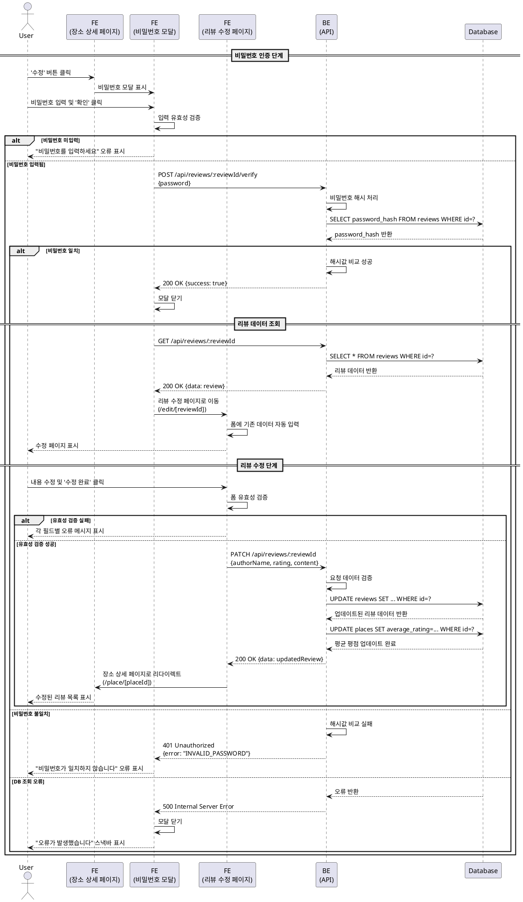

# 유스케이스 003: 기존 리뷰 수정

## 1. 개요

사용자가 자신이 작성한 리뷰의 내용을 수정할 수 있는 기능입니다. 비밀번호 인증을 통해 본인 확인 후 리뷰 내용, 평점, 작성자명을 수정할 수 있습니다.

---

## 2. 유스케이스 정의

### 2.1 Primary Actor
- **리뷰어 (Reviewer)**: 이전에 작성한 리뷰를 수정하고자 하는 사용자

### 2.2 Precondition
- 사용자가 장소 상세 페이지에 접근한 상태
- 수정하려는 리뷰가 해당 장소에 존재함
- 사용자가 리뷰 작성 시 설정한 비밀번호를 기억하고 있음

### 2.3 Trigger
- 사용자가 장소 상세 페이지의 리뷰 목록에서 특정 리뷰의 **'수정'** 버튼을 클릭

---

## 3. Main Scenario

### 3.1 비밀번호 인증 단계

1. 사용자가 장소 상세 페이지(`/place/[placeId]`)에서 수정하려는 리뷰의 '수정' 버튼을 클릭한다.
2. 시스템이 '비밀번호 확인 모달'을 화면에 표시한다.
3. 사용자가 모달의 비밀번호 입력 필드에 리뷰 작성 시 설정했던 비밀번호를 입력한다.
4. 사용자가 모달의 '확인' 버튼을 클릭한다.
5. 시스템이 입력된 비밀번호를 해시 처리한다.
6. 시스템이 서버에 비밀번호 인증 API를 요청한다 (`POST /api/reviews/:reviewId/verify`).
7. 서버가 DB에서 해당 리뷰의 해시된 비밀번호를 조회한다.
8. 서버가 입력된 비밀번호의 해시값과 DB의 해시값을 비교하여 인증을 수행한다.
9. 인증이 성공하면 서버가 성공 응답을 반환한다.

### 3.2 리뷰 수정 단계

10. 시스템이 '비밀번호 확인 모달'을 닫는다.
11. 시스템이 해당 리뷰의 기존 데이터를 조회하는 API를 요청한다 (`GET /api/reviews/:reviewId`).
12. 서버가 DB에서 리뷰 데이터(작성자명, 평점, 내용)를 조회하여 반환한다.
13. 시스템이 사용자를 리뷰 수정 페이지(`/edit/[reviewId]`)로 이동시킨다.
14. 리뷰 수정 페이지의 폼에 기존 데이터가 자동으로 채워진다.
15. 사용자가 원하는 내용(작성자명, 평점, 리뷰 내용)을 수정한다.
16. 사용자가 '수정 완료' 버튼을 클릭한다.
17. 시스템이 폼 데이터의 유효성을 검증한다.
18. 시스템이 서버에 리뷰 수정 API를 요청한다 (`PATCH /api/reviews/:reviewId`).
19. 서버가 DB의 해당 리뷰 레코드를 업데이트한다.
20. 서버가 해당 장소의 평균 평점을 재계산하여 `places` 테이블을 업데이트한다.
21. 서버가 성공 응답을 반환한다.
22. 시스템이 사용자를 장소 상세 페이지(`/place/[placeId]`)로 리다이렉트시킨다.
23. 사용자가 리뷰 목록에서 수정된 내용을 확인한다.

---

## 4. Edge Cases

### 4.1 비밀번호 미입력
- **상황**: 사용자가 비밀번호를 입력하지 않고 '확인' 버튼을 클릭
- **처리**: 모달 내 입력 필드 하단에 "비밀번호를 입력하세요" 오류 메시지 표시

### 4.2 비밀번호 불일치
- **상황**: 입력한 비밀번호가 저장된 해시값과 일치하지 않음
- **처리**: 모달 내에 "비밀번호가 일치하지 않습니다" 오류 메시지 표시

### 4.3 서버 오류 (인증 단계)
- **상황**: 비밀번호 인증 과정에서 DB 조회 실패 또는 서버 오류 발생
- **처리**: 모달을 닫고 "오류가 발생했습니다. 다시 시도해주세요" 스낵바 표시

### 4.4 폼 유효성 검증 실패
- **상황**: 수정 폼에서 필수 필드가 누락되거나 형식이 올바르지 않음
- **처리**: 각 입력 필드 하단에 해당하는 오류 메시지 표시 (예: "작성자명을 입력하세요", "평점을 선택하세요")

### 4.5 서버 오류 (수정 단계)
- **상황**: 리뷰 수정 요청 처리 중 DB 업데이트 실패 또는 서버 오류 발생
- **처리**: 리뷰 수정 페이지에 머무르며 "저장에 실패했습니다. 잠시 후 다시 시도해주세요" 모달 또는 스낵바 표시

### 4.6 리뷰가 존재하지 않음
- **상황**: 수정하려는 리뷰가 이미 삭제되었거나 존재하지 않음
- **처리**: "해당 리뷰를 찾을 수 없습니다" 오류 메시지와 함께 장소 상세 페이지로 리다이렉트

---

## 5. Business Rules

### 5.1 비밀번호 정책
- 비밀번호는 원본을 저장하지 않으며, bcrypt 등의 단방향 해시 알고리즘으로 처리
- 비밀번호 인증은 클라이언트가 전송한 평문 비밀번호를 서버에서 해시하여 DB의 해시값과 비교
- 비밀번호 자체는 수정할 수 없음 (리뷰 작성 시 설정한 비밀번호가 유지됨)

### 5.2 수정 가능한 필드
- 작성자명 (author_name)
- 평점 (rating: 1~5)
- 리뷰 내용 (content)

### 5.3 평균 평점 갱신
- 리뷰 수정 시 해당 장소의 모든 리뷰 평점을 기반으로 평균 평점을 재계산
- `places.average_rating` 필드를 자동으로 업데이트
- 평균 평점은 소수점 첫째 자리까지 표시 (예: 4.3)

### 5.4 타임스탬프 관리
- `reviews.updated_at` 필드는 트리거를 통해 자동으로 현재 시각으로 갱신
- `reviews.created_at` 필드는 변경되지 않음 (최초 작성 시각 유지)

### 5.5 API Specification

#### 5.5.1 비밀번호 인증 API

**Endpoint**: `POST /api/reviews/:reviewId/verify`

**Request**:
```typescript
{
  password: string  // 평문 비밀번호 (4-20자)
}
```

**Response (Success - 200)**:
```typescript
{
  success: true,
  message: "인증되었습니다"
}
```

**Response (Failure - 401)**:
```typescript
{
  success: false,
  error: "INVALID_PASSWORD",
  message: "비밀번호가 일치하지 않습니다"
}
```

**Response (Failure - 404)**:
```typescript
{
  success: false,
  error: "REVIEW_NOT_FOUND",
  message: "리뷰를 찾을 수 없습니다"
}
```

#### 5.5.2 리뷰 조회 API

**Endpoint**: `GET /api/reviews/:reviewId`

**Response (Success - 200)**:
```typescript
{
  success: true,
  data: {
    id: string,          // UUID
    placeId: string,     // UUID
    authorName: string,
    rating: number,      // 1-5
    content: string,
    createdAt: string,   // ISO 8601
    updatedAt: string    // ISO 8601
  }
}
```

**Response (Failure - 404)**:
```typescript
{
  success: false,
  error: "REVIEW_NOT_FOUND",
  message: "리뷰를 찾을 수 없습니다"
}
```

#### 5.5.3 리뷰 수정 API

**Endpoint**: `PATCH /api/reviews/:reviewId`

**Request**:
```typescript
{
  authorName: string,  // 1-50자
  rating: number,      // 1-5 정수
  content: string      // 1-1000자
}
```

**Response (Success - 200)**:
```typescript
{
  success: true,
  data: {
    id: string,
    placeId: string,
    authorName: string,
    rating: number,
    content: string,
    updatedAt: string
  }
}
```

**Response (Failure - 400)**:
```typescript
{
  success: false,
  error: "VALIDATION_ERROR",
  message: "입력 데이터가 올바르지 않습니다",
  details: {
    field: string,
    message: string
  }[]
}
```

**Response (Failure - 404)**:
```typescript
{
  success: false,
  error: "REVIEW_NOT_FOUND",
  message: "리뷰를 찾을 수 없습니다"
}
```

### 5.6 Database Operations

#### 5.6.1 비밀번호 인증 시
```sql
-- 리뷰의 password_hash 조회
SELECT password_hash
FROM reviews
WHERE id = $1;
```

#### 5.6.2 리뷰 데이터 조회 시
```sql
-- 리뷰 전체 데이터 조회
SELECT id, place_id, author_name, rating, content, created_at, updated_at
FROM reviews
WHERE id = $1;
```

#### 5.6.3 리뷰 수정 시
```sql
-- 리뷰 업데이트 (updated_at은 트리거로 자동 갱신)
UPDATE reviews
SET author_name = $2, rating = $3, content = $4
WHERE id = $1
RETURNING id, place_id, author_name, rating, content, updated_at;

-- 장소의 평균 평점 재계산
UPDATE places
SET average_rating = (
  SELECT ROUND(AVG(rating)::numeric, 1)
  FROM reviews
  WHERE place_id = $2
)
WHERE id = $2;
```

---

## 6. Sequence Diagram



---

## 7. 후속 액션

- 리뷰 수정 완료 후 장소 상세 페이지에서 업데이트된 평균 평점 확인
- 수정된 리뷰의 `updated_at` 타임스탬프가 갱신되어 표시됨
- 평점이 변경된 경우 장소의 평균 평점이 즉시 반영됨

---

## 8. 관련 유스케이스

- **UC-002**: 신규 리뷰 작성 및 저장 (비밀번호 설정 로직 공유)
- **UC-004**: 기존 리뷰 삭제 (비밀번호 인증 로직 공유)
- **UC-005**: 장소 상세 정보 조회 (수정 후 리다이렉트 대상 페이지)
