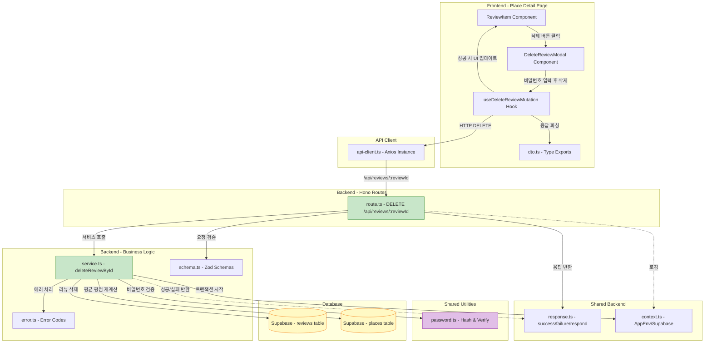

# Use Case 004 구현 계획: 기존 리뷰 삭제

## 개요

본 문서는 Use Case 004 (기존 리뷰 삭제 기능)을 구현하기 위한 모듈 설계 및 구현 계획입니다. 사용자가 비밀번호 인증을 통해 자신이 작성한 리뷰를 삭제하고, 장소의 평균 평점 및 리뷰 개수를 자동으로 갱신하며, 마지막 리뷰 삭제 시 지도에서 마커를 제거하는 기능을 포함합니다.

### 주요 특징
- **비밀번호 인증**: 리뷰 삭제 전 비밀번호 확인을 통한 본인 인증
- **트랜잭션 처리**: 리뷰 삭제와 장소 정보 갱신을 원자적으로 처리
- **평균 평점 재계산**: 리뷰 삭제 후 남은 리뷰들의 평균 평점 자동 재계산
- **마커 자동 제거**: 마지막 리뷰 삭제 시 `review_count`가 0이 되어 지도에서 자동으로 마커 제거됨
- **CASCADE 처리**: `reviews` 테이블의 `place_id` 외래키는 `ON DELETE CASCADE` 설정

---

## 모듈 목록

### Backend 모듈

#### 1. `/src/features/reviews/backend/schema.ts` (수정)
- **설명**: 리뷰 삭제 관련 스키마 추가
- **역할**:
  - `DeleteReviewRequestSchema`: 삭제 요청 시 비밀번호 검증 스키마
  - `DeleteReviewResponseSchema`: 삭제 응답 스키마 (삭제된 리뷰 ID, 갱신된 장소 정보)

#### 2. `/src/features/reviews/backend/error.ts` (수정)
- **설명**: 리뷰 삭제 관련 에러 코드 추가
- **역할**:
  - `PASSWORD_MISMATCH`: 비밀번호 불일치
  - `REVIEW_NOT_FOUND`: 리뷰를 찾을 수 없음
  - `REVIEW_DELETE_ERROR`: 리뷰 삭제 중 DB 오류
  - `PLACE_UPDATE_ERROR`: 장소 정보 갱신 중 오류

#### 3. `/src/features/reviews/backend/service.ts` (수정)
- **설명**: 리뷰 삭제 비즈니스 로직 추가
- **역할**:
  - `deleteReviewById()`: 비밀번호 인증, 리뷰 삭제, 장소 정보 갱신 처리
  - 트랜잭션 관리
  - bcrypt를 사용한 비밀번호 검증
  - 평균 평점 및 리뷰 개수 재계산

#### 4. `/src/features/reviews/backend/route.ts` (수정)
- **설명**: 리뷰 삭제 API 라우터 추가
- **역할**:
  - `DELETE /api/reviews/:reviewId` 엔드포인트 정의
  - 요청 검증 (비밀번호 포함)
  - Service 호출 및 응답 반환

#### 5. `/src/lib/auth/password.ts` (신규)
- **설명**: 비밀번호 해싱 및 검증 유틸리티
- **역할**:
  - `hashPassword()`: bcrypt를 사용한 비밀번호 해싱
  - `verifyPassword()`: 비밀번호 검증
  - 재사용 가능한 공통 모듈

### Frontend 모듈

#### 6. `/src/features/reviews/lib/dto.ts` (수정)
- **설명**: 백엔드 스키마 재노출 (프론트엔드용)
- **역할**:
  - `DeleteReviewRequest`, `DeleteReviewResponse` 타입 재노출
  - React Query 훅에서 사용

#### 7. `/src/features/reviews/hooks/useDeleteReviewMutation.ts` (신규)
- **설명**: 리뷰 삭제 API 호출 React Query Mutation 훅
- **역할**:
  - `useDeleteReviewMutation(reviewId)` 훅 제공
  - 낙관적 업데이트 (Optimistic Update) 적용
  - 에러 처리 및 롤백

#### 8. `/src/features/reviews/components/delete-review-modal.tsx` (신규)
- **설명**: 비밀번호 확인 및 삭제 확인 모달 컴포넌트
- **역할**:
  - 비밀번호 입력 필드
  - 삭제 경고 메시지
  - 삭제 확인 및 취소 버튼
  - 에러 메시지 표시

#### 9. `/src/features/reviews/components/review-item.tsx` (수정)
- **설명**: 리뷰 항목 컴포넌트에 삭제 버튼 추가
- **역할**:
  - '삭제' 버튼 추가
  - 삭제 모달 트리거
  - 삭제 완료 후 UI 업데이트

### 통합 모듈

#### 10. `/src/app/place/[placeId]/page.tsx` (수정)
- **설명**: 장소 상세 페이지에서 삭제 기능 통합
- **역할**:
  - 삭제 모달 컴포넌트 배치
  - 삭제 완료 후 리뷰 목록 갱신
  - 마지막 리뷰 삭제 시 "작성된 리뷰가 없습니다" 상태 표시

---

## 모듈 관계 다이어그램



---

## 구현 계획

### Phase 1: 공통 유틸리티 구현

#### 1.1. `/src/lib/auth/password.ts`

**목적**: 비밀번호 해싱 및 검증 로직을 재사용 가능한 공통 모듈로 분리

**구현 내용**:
```typescript
import bcrypt from 'bcrypt';

const SALT_ROUNDS = 10;

/**
 * 비밀번호를 bcrypt로 해시 처리
 * @param password 평문 비밀번호
 * @returns 해시된 비밀번호
 */
export const hashPassword = async (password: string): Promise<string> => {
  return bcrypt.hash(password, SALT_ROUNDS);
};

/**
 * 비밀번호 검증
 * @param password 평문 비밀번호
 * @param hash DB에 저장된 해시값
 * @returns 일치 여부
 */
export const verifyPassword = async (
  password: string,
  hash: string,
): Promise<boolean> => {
  return bcrypt.compare(password, hash);
};
```

**의존성 설치**:
```bash
npm install bcrypt
npm install -D @types/bcrypt
```

**단위 테스트 시나리오** (`password.test.ts`):
- ✅ `hashPassword()` 호출 시 매번 다른 해시값 생성 (salt 적용 확인)
- ✅ `verifyPassword()`로 올바른 비밀번호 검증 시 `true` 반환
- ✅ `verifyPassword()`로 잘못된 비밀번호 검증 시 `false` 반환
- ✅ 빈 문자열 비밀번호 처리

---

### Phase 2: Backend 모듈 구현

#### 2.1. `/src/features/reviews/backend/schema.ts` (수정)

**추가 스키마**:
```typescript
import { z } from 'zod';

// 기존 스키마들...

// 리뷰 삭제 요청 스키마
export const DeleteReviewRequestSchema = z.object({
  password: z
    .string()
    .min(4, { message: '비밀번호는 최소 4자 이상이어야 합니다.' })
    .max(100, { message: '비밀번호는 최대 100자까지 입력 가능합니다.' }),
});

export type DeleteReviewRequest = z.infer<typeof DeleteReviewRequestSchema>;

// 갱신된 장소 정보 스키마
export const UpdatedPlaceInfoSchema = z.object({
  reviewCount: z.number().int().nonnegative(),
  averageRating: z.number().min(0).max(5),
  markerVisible: z.boolean(),
});

export type UpdatedPlaceInfo = z.infer<typeof UpdatedPlaceInfoSchema>;

// 리뷰 삭제 응답 스키마
export const DeleteReviewResponseSchema = z.object({
  deletedReviewId: z.string().uuid(),
  placeId: z.string().uuid(),
  updatedPlace: UpdatedPlaceInfoSchema,
});

export type DeleteReviewResponse = z.infer<typeof DeleteReviewResponseSchema>;
```

#### 2.2. `/src/features/reviews/backend/error.ts` (수정)

**추가 에러 코드**:
```typescript
export const reviewErrorCodes = {
  // 기존 에러 코드들...
  passwordMismatch: 'PASSWORD_MISMATCH',
  reviewNotFound: 'REVIEW_NOT_FOUND',
  reviewDeleteError: 'REVIEW_DELETE_ERROR',
  placeUpdateError: 'PLACE_UPDATE_ERROR',
} as const;

type ReviewErrorValue = (typeof reviewErrorCodes)[keyof typeof reviewErrorCodes];

export type ReviewServiceError = ReviewErrorValue;
```

#### 2.3. `/src/features/reviews/backend/service.ts` (수정)

**신규 서비스 함수**:
```typescript
import type { SupabaseClient } from '@supabase/supabase-js';
import {
  failure,
  success,
  type HandlerResult,
} from '@/backend/http/response';
import { verifyPassword } from '@/lib/auth/password';
import {
  DeleteReviewResponseSchema,
  type DeleteReviewResponse,
} from '@/features/reviews/backend/schema';
import {
  reviewErrorCodes,
  type ReviewServiceError,
} from '@/features/reviews/backend/error';

/**
 * 리뷰 삭제
 * @param client Supabase 클라이언트
 * @param reviewId 삭제할 리뷰 ID
 * @param password 사용자가 입력한 비밀번호 (평문)
 * @returns 삭제 결과 (삭제된 리뷰 ID, 갱신된 장소 정보)
 */
export const deleteReviewById = async (
  client: SupabaseClient,
  reviewId: string,
  password: string,
): Promise<HandlerResult<DeleteReviewResponse, ReviewServiceError, unknown>> => {
  // 1. 리뷰 조회 (password_hash, place_id 포함)
  const { data: review, error: fetchError } = await client
    .from('reviews')
    .select('id, place_id, password_hash')
    .eq('id', reviewId)
    .maybeSingle();

  if (fetchError) {
    return failure(
      500,
      reviewErrorCodes.reviewDeleteError,
      '리뷰 조회 중 오류가 발생했습니다.',
      fetchError.message,
    );
  }

  if (!review) {
    return failure(
      404,
      reviewErrorCodes.reviewNotFound,
      '리뷰를 찾을 수 없습니다.',
    );
  }

  // 2. 비밀번호 검증
  const isPasswordValid = await verifyPassword(password, review.password_hash);

  if (!isPasswordValid) {
    return failure(
      401,
      reviewErrorCodes.passwordMismatch,
      '비밀번호가 일치하지 않습니다.',
    );
  }

  // 3. 트랜잭션 시작 (Supabase는 RPC를 통한 트랜잭션 지원)
  // 또는 수동으로 DELETE → UPDATE 순차 실행 후 에러 시 롤백 로직 구현

  // 3-1. 리뷰 삭제
  const { error: deleteError } = await client
    .from('reviews')
    .delete()
    .eq('id', reviewId);

  if (deleteError) {
    return failure(
      500,
      reviewErrorCodes.reviewDeleteError,
      '리뷰 삭제 중 오류가 발생했습니다.',
      deleteError.message,
    );
  }

  // 3-2. 장소 정보 갱신 (평균 평점, 리뷰 개수 재계산)
  const { data: updatedPlace, error: updateError } = await client.rpc(
    'update_place_after_review_delete',
    { place_uuid: review.place_id },
  );

  if (updateError) {
    // 롤백 불가능 (리뷰는 이미 삭제됨)
    // 로깅 후 에러 반환
    return failure(
      500,
      reviewErrorCodes.placeUpdateError,
      '장소 정보 갱신 중 오류가 발생했습니다.',
      updateError.message,
    );
  }

  // 4. 응답 데이터 구성
  const reviewCount = updatedPlace?.review_count ?? 0;
  const averageRating = updatedPlace?.average_rating ?? 0.0;

  const response: DeleteReviewResponse = {
    deletedReviewId: reviewId,
    placeId: review.place_id,
    updatedPlace: {
      reviewCount,
      averageRating: Number(averageRating),
      markerVisible: reviewCount > 0,
    },
  };

  // 5. 스키마 검증
  const parsed = DeleteReviewResponseSchema.safeParse(response);

  if (!parsed.success) {
    return failure(
      500,
      reviewErrorCodes.reviewDeleteError,
      '응답 데이터 검증 실패',
      parsed.error.format(),
    );
  }

  return success(parsed.data);
};
```

**참고**: Supabase의 경우 트랜잭션을 직접 지원하지 않으므로, PostgreSQL Function(RPC)을 사용하여 원자적 처리를 구현합니다. 이를 위해 마이그레이션 파일에 함수를 추가합니다.

**단위 테스트 시나리오** (`service.test.ts`):
- ✅ 올바른 비밀번호로 리뷰 삭제 시 성공 응답 반환
- ✅ 잘못된 비밀번호로 삭제 시 `PASSWORD_MISMATCH` 반환 (401)
- ✅ 존재하지 않는 리뷰 ID로 삭제 시 `REVIEW_NOT_FOUND` 반환 (404)
- ✅ DB 삭제 실패 시 `REVIEW_DELETE_ERROR` 반환 (500)
- ✅ 마지막 리뷰 삭제 시 `reviewCount: 0`, `markerVisible: false` 반환
- ✅ 다른 리뷰가 남아있을 때 `markerVisible: true` 반환

#### 2.4. `/src/features/reviews/backend/route.ts` (수정)

**신규 라우터 추가**:
```typescript
import type { Hono } from 'hono';
import {
  failure,
  respond,
  type ErrorResult,
} from '@/backend/http/response';
import {
  getLogger,
  getSupabase,
  type AppEnv,
} from '@/backend/hono/context';
import {
  DeleteReviewRequestSchema,
} from '@/features/reviews/backend/schema';
import { deleteReviewById } from './service';
import {
  reviewErrorCodes,
  type ReviewServiceError,
} from './error';

export const registerReviewRoutes = (app: Hono<AppEnv>) => {
  // 기존 라우터들...

  // DELETE /api/reviews/:reviewId - 리뷰 삭제
  app.delete('/reviews/:reviewId', async (c) => {
    const reviewId = c.req.param('reviewId');

    // UUID 검증
    const uuidRegex =
      /^[0-9a-f]{8}-[0-9a-f]{4}-[0-9a-f]{4}-[0-9a-f]{4}-[0-9a-f]{12}$/i;

    if (!uuidRegex.test(reviewId)) {
      return respond(
        c,
        failure(
          400,
          reviewErrorCodes.reviewNotFound,
          '유효하지 않은 리뷰 ID입니다.',
        ),
      );
    }

    // 요청 본문 파싱
    const body = await c.req.json();
    const parsedRequest = DeleteReviewRequestSchema.safeParse(body);

    if (!parsedRequest.success) {
      return respond(
        c,
        failure(
          400,
          'INVALID_DELETE_REQUEST',
          '요청 데이터가 유효하지 않습니다.',
          parsedRequest.error.format(),
        ),
      );
    }

    const supabase = getSupabase(c);
    const logger = getLogger(c);

    const result = await deleteReviewById(
      supabase,
      reviewId,
      parsedRequest.data.password,
    );

    // 에러 로깅
    if (!result.ok) {
      const errorResult = result as ErrorResult<ReviewServiceError, unknown>;

      if (errorResult.error.code === reviewErrorCodes.passwordMismatch) {
        logger.warn(`Password mismatch for review: ${reviewId}`);
      } else if (errorResult.error.code === reviewErrorCodes.reviewDeleteError) {
        logger.error('Review delete error', errorResult.error);
      } else if (errorResult.error.code === reviewErrorCodes.placeUpdateError) {
        logger.error('Place update error after review delete', errorResult.error);
      }
    } else {
      logger.info(`Review deleted: ${reviewId}, place: ${result.data.placeId}`);
    }

    return respond(c, result);
  });
};
```

#### 2.5. 데이터베이스 함수 추가 (마이그레이션)

**파일**: `/supabase/migrations/0006_create_update_place_function.sql`

```sql
-- Migration: Create function for updating place after review delete
-- Description: 리뷰 삭제 후 장소의 평균 평점 및 리뷰 개수를 원자적으로 갱신하는 함수
-- Created: 2025-10-21

BEGIN;

-- 리뷰 삭제 후 장소 정보 갱신 함수
CREATE OR REPLACE FUNCTION update_place_after_review_delete(place_uuid UUID)
RETURNS TABLE(review_count INTEGER, average_rating DECIMAL(2, 1))
LANGUAGE plpgsql
AS $$
BEGIN
  -- 장소의 리뷰 개수 및 평균 평점 재계산
  UPDATE places
  SET
    review_count = (
      SELECT COUNT(*)
      FROM reviews
      WHERE place_id = place_uuid
    ),
    average_rating = COALESCE(
      (
        SELECT ROUND(AVG(rating)::numeric, 1)
        FROM reviews
        WHERE place_id = place_uuid
      ),
      0.0
    ),
    updated_at = NOW()
  WHERE id = place_uuid;

  -- 갱신된 값 반환
  RETURN QUERY
  SELECT p.review_count, p.average_rating
  FROM places p
  WHERE p.id = place_uuid;
END;
$$;

COMMENT ON FUNCTION update_place_after_review_delete(UUID) IS '리뷰 삭제 후 장소의 평균 평점 및 리뷰 개수를 재계산하여 갱신';

COMMIT;

-- Rollback script (참고용)
-- BEGIN;
-- DROP FUNCTION IF EXISTS update_place_after_review_delete(UUID);
-- COMMIT;
```

---

### Phase 3: Frontend 모듈 구현

#### 3.1. `/src/features/reviews/lib/dto.ts` (수정)

**추가 타입 재노출**:
```typescript
export {
  // 기존 타입들...
  DeleteReviewRequestSchema,
  DeleteReviewResponseSchema,
  UpdatedPlaceInfoSchema,
  type DeleteReviewRequest,
  type DeleteReviewResponse,
  type UpdatedPlaceInfo,
} from '@/features/reviews/backend/schema';
```

#### 3.2. `/src/features/reviews/hooks/useDeleteReviewMutation.ts` (신규)

```typescript
'use client';

import { useMutation, useQueryClient } from '@tanstack/react-query';
import { apiClient, extractApiErrorMessage } from '@/lib/remote/api-client';
import {
  DeleteReviewRequestSchema,
  DeleteReviewResponseSchema,
  type DeleteReviewRequest,
  type DeleteReviewResponse,
} from '@/features/reviews/lib/dto';

const deleteReview = async (
  reviewId: string,
  request: DeleteReviewRequest,
): Promise<DeleteReviewResponse> => {
  try {
    const { data } = await apiClient.delete(`/api/reviews/${reviewId}`, {
      data: request,
    });

    // 응답 스키마 검증
    const parsed = DeleteReviewResponseSchema.parse(data);
    return parsed;
  } catch (error) {
    const message = extractApiErrorMessage(
      error,
      '리뷰 삭제 중 오류가 발생했습니다.',
    );
    throw new Error(message);
  }
};

export const useDeleteReviewMutation = () => {
  const queryClient = useQueryClient();

  return useMutation({
    mutationFn: ({
      reviewId,
      password,
    }: {
      reviewId: string;
      password: string;
    }) => deleteReview(reviewId, { password }),
    onSuccess: (data) => {
      // 장소 상세 페이지의 리뷰 목록 쿼리 무효화 (자동 리페치)
      queryClient.invalidateQueries({
        queryKey: ['place', data.placeId],
      });

      // 마커 목록 쿼리 무효화 (마지막 리뷰 삭제 시 마커 제거 반영)
      if (!data.updatedPlace.markerVisible) {
        queryClient.invalidateQueries({
          queryKey: ['places'],
        });
      }
    },
    onError: (error) => {
      console.error('Review delete error:', error);
    },
  });
};
```

#### 3.3. `/src/features/reviews/components/delete-review-modal.tsx` (신규)

```typescript
'use client';

import { useState } from 'react';
import { Trash2 } from 'lucide-react';
import { Button } from '@/components/ui/button';
import {
  Dialog,
  DialogContent,
  DialogDescription,
  DialogFooter,
  DialogHeader,
  DialogTitle,
} from '@/components/ui/dialog';
import { Input } from '@/components/ui/input';
import { Label } from '@/components/ui/label';
import { useDeleteReviewMutation } from '@/features/reviews/hooks/useDeleteReviewMutation';
import { useToast } from '@/hooks/use-toast';

interface DeleteReviewModalProps {
  reviewId: string;
  isOpen: boolean;
  onClose: () => void;
}

export const DeleteReviewModal = ({
  reviewId,
  isOpen,
  onClose,
}: DeleteReviewModalProps) => {
  const [password, setPassword] = useState('');
  const [error, setError] = useState<string | null>(null);

  const { mutate: deleteReview, isPending } = useDeleteReviewMutation();
  const { toast } = useToast();

  const handleDelete = () => {
    // 클라이언트 측 검증
    if (!password || password.length < 4) {
      setError('비밀번호는 최소 4자 이상이어야 합니다.');
      return;
    }

    setError(null);

    deleteReview(
      { reviewId, password },
      {
        onSuccess: (data) => {
          toast({
            title: '리뷰 삭제 완료',
            description: '리뷰가 성공적으로 삭제되었습니다.',
          });

          // 마지막 리뷰 삭제 시 안내
          if (!data.updatedPlace.markerVisible) {
            toast({
              title: '마커 제거됨',
              description: '마지막 리뷰가 삭제되어 지도에서 마커가 제거되었습니다.',
            });
          }

          onClose();
          setPassword('');
        },
        onError: (error) => {
          setError(error.message);
        },
      },
    );
  };

  const handleClose = () => {
    setPassword('');
    setError(null);
    onClose();
  };

  return (
    <Dialog open={isOpen} onOpenChange={handleClose}>
      <DialogContent>
        <DialogHeader>
          <DialogTitle className="flex items-center gap-2">
            <Trash2 className="h-5 w-5 text-destructive" />
            리뷰 삭제
          </DialogTitle>
          <DialogDescription>
            이 작업은 되돌릴 수 없습니다. 리뷰를 삭제하시려면 비밀번호를 입력하세요.
          </DialogDescription>
        </DialogHeader>

        <div className="space-y-4 py-4">
          <div className="space-y-2">
            <Label htmlFor="password">비밀번호</Label>
            <Input
              id="password"
              type="password"
              placeholder="리뷰 작성 시 설정한 비밀번호"
              value={password}
              onChange={(e) => {
                setPassword(e.target.value);
                setError(null);
              }}
              disabled={isPending}
              aria-label="비밀번호"
            />
            {error && (
              <p className="text-sm text-destructive" role="alert">
                {error}
              </p>
            )}
          </div>
        </div>

        <DialogFooter>
          <Button
            variant="outline"
            onClick={handleClose}
            disabled={isPending}
          >
            취소
          </Button>
          <Button
            variant="destructive"
            onClick={handleDelete}
            disabled={isPending}
          >
            {isPending ? '삭제 중...' : '삭제'}
          </Button>
        </DialogFooter>
      </DialogContent>
    </Dialog>
  );
};
```

**QA Sheet** (`delete-review-modal.qa.md`):
- ✅ 모달 열림 시 비밀번호 입력 필드 포커스
- ✅ 비밀번호 미입력 시 "비밀번호는 최소 4자 이상이어야 합니다." 메시지 표시
- ✅ 비밀번호 불일치 시 서버 에러 메시지 표시
- ✅ 삭제 중일 때 버튼 비활성화 및 "삭제 중..." 텍스트 표시
- ✅ 삭제 성공 시 토스트 메시지 표시 및 모달 닫기
- ✅ 취소 버튼 클릭 시 모달 닫기 및 입력 필드 초기화
- ✅ 마지막 리뷰 삭제 시 "마커 제거됨" 토스트 추가 표시

#### 3.4. `/src/features/reviews/components/review-item.tsx` (수정)

```typescript
'use client';

import { useState } from 'react';
import { Pencil, Trash2 } from 'lucide-react';
import { Button } from '@/components/ui/button';
import {
  Card,
  CardContent,
  CardDescription,
  CardHeader,
  CardTitle,
} from '@/components/ui/card';
import { DeleteReviewModal } from './delete-review-modal';
import type { Review } from '@/features/reviews/lib/dto';

interface ReviewItemProps {
  review: Review;
}

export const ReviewItem = ({ review }: ReviewItemProps) => {
  const [isDeleteModalOpen, setIsDeleteModalOpen] = useState(false);

  return (
    <>
      <Card>
        <CardHeader>
          <CardTitle className="flex items-center justify-between">
            <span>{review.authorName}</span>
            <span className="text-lg text-yellow-500">
              {'★'.repeat(review.rating)}
              {'☆'.repeat(5 - review.rating)}
            </span>
          </CardTitle>
          <CardDescription>
            {new Date(review.createdAt).toLocaleDateString('ko-KR')}
          </CardDescription>
        </CardHeader>
        <CardContent className="space-y-3">
          <p className="text-sm">{review.content}</p>

          <div className="flex gap-2">
            <Button
              variant="outline"
              size="sm"
              onClick={() => {
                // Use Case 003: 리뷰 수정 페이지로 이동 (향후 구현)
                // router.push(`/edit/${review.id}`)
              }}
            >
              <Pencil className="h-4 w-4 mr-1" />
              수정
            </Button>
            <Button
              variant="outline"
              size="sm"
              onClick={() => setIsDeleteModalOpen(true)}
            >
              <Trash2 className="h-4 w-4 mr-1" />
              삭제
            </Button>
          </div>
        </CardContent>
      </Card>

      <DeleteReviewModal
        reviewId={review.id}
        isOpen={isDeleteModalOpen}
        onClose={() => setIsDeleteModalOpen(false)}
      />
    </>
  );
};
```

**QA Sheet** (`review-item.qa.md`):
- ✅ 리뷰 항목에 작성자명, 평점, 내용, 작성일 표시
- ✅ '삭제' 버튼 클릭 시 삭제 모달 열림
- ✅ 삭제 모달 닫힘 후 버튼 다시 클릭 가능
- ✅ 삭제 완료 후 리뷰 항목이 목록에서 제거됨

---

### Phase 4: 장소 상세 페이지 통합

#### 4.1. `/src/app/place/[placeId]/page.tsx` (수정)

```typescript
'use client';

import { use } from 'react';
import { useRouter } from 'next/navigation';
import { MapPin } from 'lucide-react';
import { Button } from '@/components/ui/button';
import { ReviewItem } from '@/features/reviews/components/review-item';
import { usePlaceQuery } from '@/features/places/hooks/usePlaceQuery';
// 가정: usePlaceQuery는 장소 정보 + 리뷰 목록을 함께 가져옴

interface PlaceDetailPageProps {
  params: Promise<{ placeId: string }>;
}

export default function PlaceDetailPage({ params }: PlaceDetailPageProps) {
  const resolvedParams = use(params);
  const router = useRouter();

  const { data, isLoading, error } = usePlaceQuery(resolvedParams.placeId);

  if (isLoading) {
    return <div className="container mx-auto p-4">로딩 중...</div>;
  }

  if (error || !data) {
    return (
      <div className="container mx-auto p-4">
        <p className="text-destructive">장소를 찾을 수 없습니다.</p>
        <Button onClick={() => router.push('/')}>메인으로 돌아가기</Button>
      </div>
    );
  }

  const { place, reviews } = data;

  return (
    <div className="container mx-auto p-4 space-y-6">
      {/* 장소 정보 */}
      <div className="space-y-2">
        <h1 className="text-3xl font-bold flex items-center gap-2">
          <MapPin className="h-6 w-6 text-primary" />
          {place.name}
        </h1>
        <p className="text-muted-foreground">{place.address}</p>
        <p className="text-sm text-muted-foreground">{place.category}</p>
        <div className="flex items-center gap-2">
          <span className="text-2xl text-yellow-500">
            {place.averageRating.toFixed(1)}
          </span>
          <span className="text-sm text-muted-foreground">
            ({place.reviewCount}개 리뷰)
          </span>
        </div>
      </div>

      {/* 리뷰 작성 버튼 */}
      <Button
        onClick={() => {
          // Use Case 002: 리뷰 작성 페이지로 이동
          router.push(`/review/new?placeId=${place.id}`);
        }}
      >
        리뷰 작성하기
      </Button>

      {/* 리뷰 목록 */}
      <div className="space-y-4">
        <h2 className="text-2xl font-semibold">리뷰 목록</h2>
        {reviews.length === 0 ? (
          <p className="text-muted-foreground">작성된 리뷰가 없습니다.</p>
        ) : (
          <div className="space-y-3">
            {reviews.map((review) => (
              <ReviewItem key={review.id} review={review} />
            ))}
          </div>
        )}
      </div>
    </div>
  );
}
```

**QA Sheet** (`place-detail-page.qa.md`):
- ✅ 장소 정보 (이름, 주소, 업종, 평균 평점, 리뷰 개수) 표시
- ✅ 리뷰 목록 표시 (최신순)
- ✅ 리뷰 없을 때 "작성된 리뷰가 없습니다" 메시지 표시
- ✅ 리뷰 삭제 후 자동으로 목록 갱신
- ✅ 마지막 리뷰 삭제 시 평균 평점 0.0, 리뷰 개수 0 표시

---

## 환경 변수 설정

`.env.local` 파일에 다음 환경 변수가 이미 설정되어 있어야 합니다:

```env
# Supabase
NEXT_PUBLIC_SUPABASE_URL=your_supabase_url
NEXT_PUBLIC_SUPABASE_ANON_KEY=your_supabase_anon_key
SUPABASE_SERVICE_ROLE_KEY=your_supabase_service_role_key
```

---

## 테스트 계획

### 단위 테스트

1. **`password.test.ts`**: 비밀번호 해싱 및 검증 유틸 테스트
2. **`service.test.ts`**: 리뷰 삭제 서비스 로직 테스트
   - 비밀번호 일치/불일치 케이스
   - 리뷰 존재/미존재 케이스
   - 평균 평점 재계산 로직
   - 마지막 리뷰 삭제 시 `markerVisible: false` 반환

### 통합 테스트

1. **API 엔드포인트 테스트**: `DELETE /api/reviews/:reviewId`
   - 정상 삭제 (200)
   - 비밀번호 불일치 (401)
   - 리뷰 없음 (404)
   - 유효하지 않은 UUID (400)
   - DB 오류 (500)

### E2E 테스트

1. 사용자가 장소 상세 페이지에서 '삭제' 버튼 클릭 → 모달 표시
2. 비밀번호 입력 후 삭제 → 리뷰 목록에서 제거
3. 마지막 리뷰 삭제 → "작성된 리뷰가 없습니다" 메시지 표시
4. 메인 페이지 지도에서 마커 제거 확인

---

## 구현 순서

1. **Phase 1**: 공통 유틸리티 구현 (`password.ts`)
2. **Phase 2**: Backend 모듈 구현 (schema, error, service, route, DB 함수)
3. **Phase 3**: Frontend 모듈 구현 (hooks, components)
4. **Phase 4**: 장소 상세 페이지 통합
5. **테스트**: 단위 테스트 및 통합 테스트 작성
6. **QA**: UI 테스트 시트 기반 검증

---

## 참고 문서

- Use Case Spec: `/docs/usecases/004/spec.md`
- Backend Architecture: `CLAUDE.md` - Backend Layer
- Database Schema: `/supabase/migrations/0003_create_reviews_table.sql`
- Related Use Cases:
  - UC-002: 신규 리뷰 작성 (비밀번호 해싱 로직 공유)
  - UC-003: 기존 리뷰 수정 (비밀번호 인증 로직 공유)

---

## 주의사항

1. **보안**: 비밀번호는 절대 평문으로 저장하지 않으며, bcrypt로 해싱 처리
2. **트랜잭션**: 리뷰 삭제와 장소 정보 갱신은 PostgreSQL Function(RPC)을 통해 원자적으로 처리
3. **롤백 처리**: Supabase의 경우 트랜잭션 지원이 제한적이므로, 에러 발생 시 적절한 로깅 및 사용자 피드백 제공
4. **접근성**: 모달 및 에러 메시지에 적절한 ARIA 속성 추가
5. **낙관적 업데이트**: 삭제 성공 시 React Query의 `invalidateQueries`로 자동 리페치 (UX 향상)
6. **마커 관리**: `review_count > 0`인 장소만 지도에 표시되므로, 마지막 리뷰 삭제 시 자동으로 마커 제거됨
7. **CASCADE**: `reviews.place_id`의 외래키는 `ON DELETE CASCADE`로 설정되어 있어, 장소 삭제 시 관련 리뷰도 함께 삭제됨 (본 Use Case와 무관하지만 참고)

---

## 추가 고려사항

### Soft Delete 방식으로 전환 (선택 사항)

향후 리뷰 복구 기능이나 관리자 페이지에서 삭제된 리뷰를 확인해야 할 경우, 다음과 같이 Soft Delete 방식으로 전환할 수 있습니다:

1. `reviews` 테이블에 `deleted_at TIMESTAMP` 컬럼 추가
2. 삭제 시 실제 DELETE 대신 `UPDATE reviews SET deleted_at = NOW()` 실행
3. 조회 시 `WHERE deleted_at IS NULL` 조건 추가
4. 평균 평점 계산 시에도 `deleted_at IS NULL` 조건 포함

**마이그레이션 예시** (선택 사항):
```sql
ALTER TABLE reviews
ADD COLUMN deleted_at TIMESTAMP WITH TIME ZONE DEFAULT NULL;

CREATE INDEX IF NOT EXISTS idx_reviews_deleted_at ON reviews(deleted_at);
```

---

## 의존성 추가

```bash
# bcrypt 설치
npm install bcrypt
npm install -D @types/bcrypt

# shadcn-ui 컴포넌트 (이미 설치되어 있을 수 있음)
npx shadcn@latest add dialog
npx shadcn@latest add label
npx shadcn@latest add toast
```

---

## 완료 조건

- [ ] `/src/lib/auth/password.ts` 구현 완료
- [ ] Backend 스키마, 에러, 서비스, 라우터 구현 완료
- [ ] PostgreSQL Function 마이그레이션 파일 작성 완료
- [ ] Frontend 훅 및 컴포넌트 구현 완료
- [ ] 장소 상세 페이지 통합 완료
- [ ] 단위 테스트 작성 및 통과
- [ ] 통합 테스트 작성 및 통과
- [ ] QA 시트 기반 UI 검증 완료
- [ ] 마지막 리뷰 삭제 시 마커 제거 동작 확인
- [ ] 비밀번호 불일치 시 에러 메시지 표시 확인
