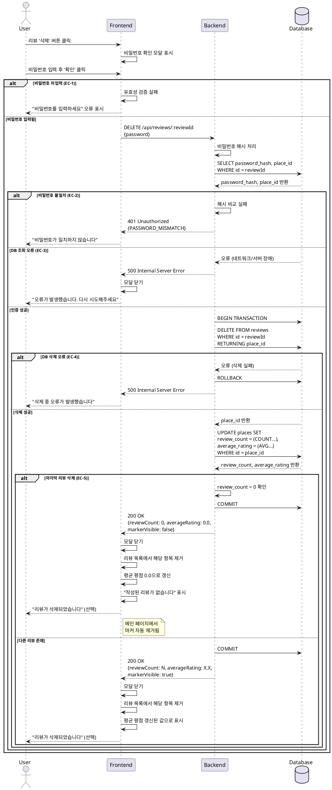

# Use Case 004: 기존 리뷰 삭제

## 개요
사용자가 자신이 작성한 리뷰를 비밀번호 인증을 통해 삭제하는 기능입니다. 리뷰 삭제 시 해당 장소의 평균 평점과 리뷰 개수가 자동으로 재계산되며, 마지막 리뷰를 삭제한 경우 지도에서 마커가 제거됩니다.

---

## Primary Actor
**리뷰어 (Reviewer)**: 자신이 이전에 작성한 리뷰를 삭제하고자 하는 사용자

---

## Precondition
- 사용자가 장소 상세 페이지(`/place/[placeId]`)에 접속한 상태
- 해당 장소에 1개 이상의 리뷰가 존재
- 사용자가 삭제하고자 하는 리뷰의 비밀번호를 알고 있음

---

## Trigger
사용자가 장소 상세 페이지의 특정 리뷰 항목에서 **'삭제'** 버튼을 클릭

---

## Main Scenario

### 1. 삭제 요청 및 비밀번호 확인 모달 표시
1. 사용자가 리뷰 항목의 '삭제' 버튼을 클릭
2. 시스템이 '비밀번호 확인 모달'을 표시 (삭제 작업임을 명확히 표시)
3. 사용자가 비밀번호를 입력하고 '확인' 버튼 클릭

### 2. 비밀번호 인증
1. 프론트엔드가 입력된 비밀번호와 `reviewId`를 백엔드로 전송
2. 백엔드가 비밀번호를 해시 처리
3. 백엔드가 DB에서 해당 리뷰의 `password_hash`를 조회하여 비교
4. 해시 값이 일치하면 인증 성공

### 3. 리뷰 삭제 및 데이터 갱신
1. 백엔드가 `reviews` 테이블에서 해당 리뷰를 삭제 (DELETE)
2. 백엔드가 삭제된 리뷰의 `place_id`를 확인
3. 백엔드가 `places` 테이블의 해당 장소 정보를 업데이트:
   - `review_count` 감소 (현재 남은 리뷰 개수로 재계산)
   - `average_rating` 재계산 (남은 리뷰들의 평균, 리뷰가 없으면 0.0)

### 4. 마커 상태 처리
1. `review_count`가 0이 되었는지 확인
2. 0인 경우: 해당 장소가 지도에 표시되지 않도록 상태 업데이트
3. 0이 아닌 경우: 마커는 유지되며 평균 평점만 갱신

### 5. 삭제 완료 및 피드백
1. 백엔드가 프론트엔드로 삭제 성공 응답 전송
2. 비밀번호 확인 모달이 닫힘
3. 장소 상세 페이지의 리뷰 목록에서 해당 리뷰 항목이 즉시 제거됨
4. 평균 평점이 갱신된 값으로 표시됨
5. (선택) "리뷰가 삭제되었습니다" 스낵바/토스트 메시지 표시

---

## Edge Cases

### EC-1: 비밀번호 미입력
- **상황**: 사용자가 비밀번호를 입력하지 않고 '확인' 버튼 클릭
- **처리**:
  - 모달이 닫히지 않음
  - 입력 필드 하단에 "비밀번호를 입력하세요" 오류 메시지 표시

### EC-2: 비밀번호 불일치 (인증 실패)
- **상황**: 입력한 비밀번호의 해시 값이 DB의 `password_hash`와 일치하지 않음
- **처리**:
  - 모달이 닫히지 않음
  - "비밀번호가 일치하지 않습니다" 오류 메시지 표시
  - 사용자가 다시 입력할 수 있도록 대기

### EC-3: DB 조회/인증 오류
- **상황**: 비밀번호 인증 과정에서 DB 조회 실패 또는 서버 오류 (5xx)
- **처리**:
  - 모달이 닫힘
  - "오류가 발생했습니다. 잠시 후 다시 시도해주세요" 스낵바 표시
  - 로그에 오류 상세 내용 기록

### EC-4: DB 삭제 오류
- **상황**: 리뷰 삭제 명령 실행 중 DB 오류 발생
- **처리**:
  - 모달이 닫힐 수 있으나 리뷰는 삭제되지 않음
  - "삭제 중 오류가 발생했습니다. 잠시 후 다시 시도해주세요" 스낵바 표시
  - 페이지 새로고침 시 리뷰가 여전히 존재함을 확인 가능

### EC-5: 마지막 리뷰 삭제
- **상황**: 삭제된 리뷰가 해당 장소의 유일한 리뷰
- **처리**:
  - `places` 테이블의 `review_count`가 0으로 업데이트
  - `average_rating`이 0.0으로 업데이트
  - 메인 지도 페이지에서 해당 장소의 마커가 더 이상 표시되지 않음
  - 장소 상세 페이지는 접근 가능하나 "작성된 리뷰가 없습니다" 상태로 표시

---

## Business Rules

### BR-1: 비밀번호 인증
- 리뷰 삭제는 반드시 비밀번호 인증을 통과해야만 실행 가능
- 비밀번호는 원본을 저장하지 않으며, bcrypt 등의 단방향 해시로 저장
- 프론트엔드에서 입력받은 비밀번호는 백엔드에서 동일한 방식으로 해시 처리하여 비교

### BR-2: 데이터 정합성
- 리뷰 삭제 시 해당 장소의 `review_count`와 `average_rating`은 **반드시** 함께 업데이트되어야 함
- 트랜잭션 처리를 통해 리뷰 삭제와 장소 정보 갱신이 원자적으로 수행되어야 함

### BR-3: 마커 표시 기준
- 지도에 표시되는 마커는 `review_count > 0`인 장소만 대상
- 마지막 리뷰 삭제 시 자동으로 마커 표시 대상에서 제외됨

### BR-4: 평균 평점 계산
- `average_rating`은 남은 리뷰들의 평점 평균을 소수점 첫째 자리까지 반올림하여 계산 (ROUND(AVG(rating), 1))
- 리뷰가 모두 삭제된 경우 `average_rating`은 0.0으로 설정

### BR-5: Cascade 삭제
- 장소(`places`)가 삭제되면 관련된 모든 리뷰(`reviews`)도 함께 삭제됨 (ON DELETE CASCADE)
- 단, 본 Use Case에서는 리뷰만 삭제하며 장소는 유지됨

### BR-6: API Specification

#### 6.1 비밀번호 인증 API

**Endpoint**: `POST /api/reviews/:reviewId/verify-password`

**Request**:
```json
{
  "password": "string (원본 비밀번호)"
}
```

**Response (성공 - 200 OK)**:
```json
{
  "success": true,
  "data": {
    "verified": true,
    "reviewId": "uuid"
  }
}
```

**Response (인증 실패 - 401 Unauthorized)**:
```json
{
  "success": false,
  "error": {
    "code": "PASSWORD_MISMATCH",
    "message": "비밀번호가 일치하지 않습니다"
  }
}
```

**Response (서버 오류 - 500)**:
```json
{
  "success": false,
  "error": {
    "code": "INTERNAL_SERVER_ERROR",
    "message": "서버 오류가 발생했습니다"
  }
}
```

#### 6.2 리뷰 삭제 API

**Endpoint**: `DELETE /api/reviews/:reviewId`

**Headers**:
```
Authorization: Bearer <password_verified_token> (선택적, 2단계 인증 방식 채택 시)
```

**Request Body (인증 통합 방식)**:
```json
{
  "password": "string (원본 비밀번호)"
}
```

**Response (성공 - 200 OK)**:
```json
{
  "success": true,
  "data": {
    "deletedReviewId": "uuid",
    "placeId": "uuid",
    "updatedPlace": {
      "reviewCount": 3,
      "averageRating": 4.2,
      "markerVisible": true
    }
  }
}
```

**Response (마지막 리뷰 삭제 시 - 200 OK)**:
```json
{
  "success": true,
  "data": {
    "deletedReviewId": "uuid",
    "placeId": "uuid",
    "updatedPlace": {
      "reviewCount": 0,
      "averageRating": 0.0,
      "markerVisible": false
    }
  }
}
```

**Response (인증 실패 - 401 Unauthorized)**:
```json
{
  "success": false,
  "error": {
    "code": "PASSWORD_MISMATCH",
    "message": "비밀번호가 일치하지 않습니다"
  }
}
```

**Response (리뷰 없음 - 404 Not Found)**:
```json
{
  "success": false,
  "error": {
    "code": "REVIEW_NOT_FOUND",
    "message": "리뷰를 찾을 수 없습니다"
  }
}
```

**Response (서버 오류 - 500)**:
```json
{
  "success": false,
  "error": {
    "code": "INTERNAL_SERVER_ERROR",
    "message": "서버 오류가 발생했습니다"
  }
}
```

---

## Database Operations

### 1. 비밀번호 조회 및 검증
```sql
-- 리뷰의 password_hash 조회
SELECT password_hash, place_id
FROM reviews
WHERE id = $1;

-- 애플리케이션 레벨에서 bcrypt.compare(입력비밀번호, password_hash) 검증
```

### 2. 리뷰 삭제
```sql
-- 리뷰 삭제 및 place_id 반환
DELETE FROM reviews
WHERE id = $1
RETURNING place_id;
```

### 3. 장소 정보 갱신
```sql
-- 리뷰 개수 및 평균 평점 재계산
UPDATE places
SET
  review_count = (SELECT COUNT(*) FROM reviews WHERE place_id = $1),
  average_rating = COALESCE(
    (SELECT ROUND(AVG(rating)::numeric, 1) FROM reviews WHERE place_id = $1),
    0.0
  ),
  updated_at = NOW()
WHERE id = $1
RETURNING review_count, average_rating;
```

### 4. 트랜잭션 처리
위의 DELETE와 UPDATE는 하나의 트랜잭션 내에서 실행되어야 합니다:
```sql
BEGIN;

DELETE FROM reviews WHERE id = $1 RETURNING place_id;
UPDATE places SET ... WHERE id = $1;

COMMIT;
```

---

## Sequence Diagram



---

## Notes
- 본 Use Case는 회원가입 없이 비밀번호만으로 리뷰를 관리하는 시스템의 특성상, 비밀번호 인증이 핵심입니다.
- 삭제는 되돌릴 수 없는 작업이므로, 모달에서 사용자에게 명확한 경고 메시지를 제공하는 것이 권장됩니다.
- 마지막 리뷰 삭제 시 장소 데이터(`places`)는 삭제하지 않고 유지하며, `review_count`와 `average_rating`만 0으로 초기화합니다.
- 향후 소프트 딜리트(soft delete) 방식으로 전환할 경우, `reviews.deleted_at` 컬럼 추가를 고려할 수 있습니다.
