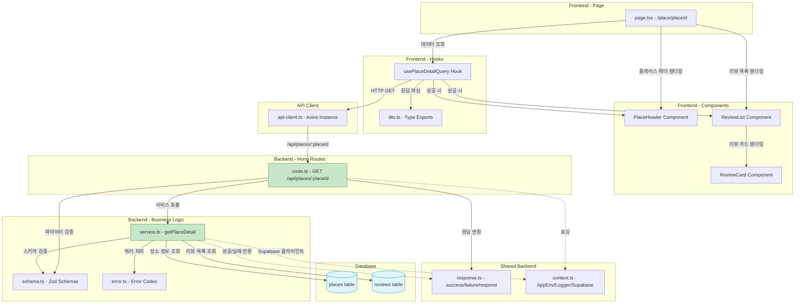

# Use Case 005 구현 계획: 장소 상세 정보 조회 (지도 마커 경유)

## 개요

본 문서는 Use Case 005 (장소 상세 정보 조회)를 구현하기 위한 모듈 설계 및 구현 계획입니다. 사용자가 지도에서 마커를 클릭하여 특정 장소의 상세 정보와 리뷰 목록을 조회하는 기능을 제공합니다.

### 주요 특징
- **읽기 전용 작업**: DB 데이터를 변경하지 않는 조회 전용 API
- **JOIN 쿼리**: 장소 정보와 리뷰 목록을 함께 조회
- **최신순 정렬**: 리뷰는 최신순(created_at DESC)으로 정렬
- **평균 평점 포함**: places 테이블에 미리 계산된 average_rating 사용
- **SSR 권장**: SEO를 고려하여 Server-Side Rendering 권장

---

## 모듈 목록

### Backend 모듈

#### 1. `/src/features/place/backend/schema.ts`
- **설명**: 장소 상세 정보 요청/응답 스키마 정의 (Zod)
- **역할**:
  - `PlaceParamsSchema`: placeId 파라미터 검증 (UUID)
  - `ReviewItemSchema`: 리뷰 단일 항목 스키마
  - `PlaceDetailSchema`: 장소 상세 정보 스키마
  - `PlaceDetailResponseSchema`: 전체 응답 스키마 (place + reviews)
  - `PlaceTableRowSchema`: places 테이블 로우 스키마
  - `ReviewTableRowSchema`: reviews 테이블 로우 스키마

#### 2. `/src/features/place/backend/error.ts`
- **설명**: 장소 조회 관련 에러 코드 정의
- **역할**:
  - `PLACE_ID_REQUIRED`: placeId 파라미터 누락
  - `PLACE_ID_INVALID`: placeId가 UUID 형식이 아님
  - `PLACE_NOT_FOUND`: 해당 placeId의 장소가 존재하지 않음
  - `PLACE_FETCH_ERROR`: DB 조회 중 서버 오류 발생
  - `REVIEWS_FETCH_ERROR`: 리뷰 목록 조회 중 서버 오류 발생

#### 3. `/src/features/place/backend/service.ts`
- **설명**: 장소 상세 정보 조회 비즈니스 로직 처리
- **역할**:
  - `getPlaceById(client, placeId)`: 장소 정보 조회
  - `getReviewsByPlaceId(client, placeId)`: 리뷰 목록 조회 (최신순)
  - `getPlaceDetail(client, placeId)`: 장소 정보 + 리뷰 목록 조합
  - 에러 핸들링 및 스키마 검증

#### 4. `/src/features/place/backend/route.ts`
- **설명**: Hono 기반 장소 상세 조회 API 라우터
- **역할**:
  - `GET /api/places/:placeId` 엔드포인트 정의
  - 파라미터 검증
  - Service 호출 및 응답 반환

### Frontend 모듈

#### 5. `/src/features/place/lib/dto.ts`
- **설명**: 백엔드 스키마 재노출 (프론트엔드용)
- **역할**:
  - `PlaceDetail`, `ReviewItem`, `PlaceDetailResponse` 타입 재노출
  - React Query 훅 및 컴포넌트에서 사용

#### 6. `/src/features/place/hooks/usePlaceDetailQuery.ts`
- **설명**: 장소 상세 정보 조회 React Query 훅
- **역할**:
  - `usePlaceDetailQuery(placeId)` 훅 제공
  - API 호출 및 캐싱
  - 에러 처리

#### 7. `/src/features/place/components/place-header.tsx`
- **설명**: 장소 기본 정보 헤더 컴포넌트
- **역할**:
  - 가게명, 주소, 업종 표시
  - 평균 평점 및 리뷰 개수 표시

#### 8. `/src/features/place/components/review-list.tsx`
- **설명**: 리뷰 목록 컴포넌트
- **역할**:
  - 리뷰 카드 목록 렌더링 (최신순)
  - 각 리뷰에 "수정" / "삭제" 버튼 표시
  - 리뷰 없을 때 안내 메시지

#### 9. `/src/features/place/components/review-card.tsx`
- **설명**: 개별 리뷰 카드 컴포넌트
- **역할**:
  - 작성자명, 평점, 내용, 작성일 표시
  - "수정" / "삭제" 버튼
  - 수정/삭제 클릭 시 비밀번호 확인 모달 트리거 (향후 구현)

#### 10. `/src/app/place/[placeId]/page.tsx`
- **설명**: 장소 상세 페이지 (Next.js App Router)
- **역할**:
  - SSR로 장소 상세 정보 렌더링
  - `PlaceHeader`, `ReviewList` 컴포넌트 조합
  - "리뷰 작성하기" 버튼 제공

### 통합 모듈

#### 11. `/src/backend/hono/app.ts` (수정)
- **설명**: Hono 앱에 장소 라우터 등록
- **역할**:
  - `registerPlaceRoutes(app)` 호출 추가

---

## 모듈 관계 다이어그램



---

## 구현 계획

### Phase 1: Backend 모듈 구현

#### 1.1. `/src/features/place/backend/schema.ts`

**목적**: 장소 상세 정보 요청/응답 스키마 정의

**구현 내용**:
```typescript
import { z } from 'zod';

// 파라미터 스키마
export const PlaceParamsSchema = z.object({
  placeId: z.string().uuid({ message: 'placeId must be a valid UUID.' }),
});

export type PlaceParams = z.infer<typeof PlaceParamsSchema>;

// 리뷰 항목 스키마
export const ReviewItemSchema = z.object({
  id: z.string().uuid(),
  authorName: z.string(),
  rating: z.number().int().min(1).max(5),
  content: z.string(),
  createdAt: z.string(), // ISO 8601
  updatedAt: z.string(), // ISO 8601
});

export type ReviewItem = z.infer<typeof ReviewItemSchema>;

// 장소 상세 정보 스키마
export const PlaceDetailSchema = z.object({
  id: z.string().uuid(),
  name: z.string(),
  address: z.string(),
  category: z.string(),
  averageRating: z.number().min(0).max(5),
  reviewCount: z.number().int().min(0),
});

export type PlaceDetail = z.infer<typeof PlaceDetailSchema>;

// 전체 응답 스키마
export const PlaceDetailResponseSchema = z.object({
  place: PlaceDetailSchema,
  reviews: z.array(ReviewItemSchema),
});

export type PlaceDetailResponse = z.infer<typeof PlaceDetailResponseSchema>;

// DB 로우 스키마 (places 테이블)
export const PlaceTableRowSchema = z.object({
  id: z.string().uuid(),
  name: z.string(),
  address: z.string(),
  category: z.string().nullable(),
  average_rating: z.number().nullable(),
  review_count: z.number().int(),
});

export type PlaceRow = z.infer<typeof PlaceTableRowSchema>;

// DB 로우 스키마 (reviews 테이블)
export const ReviewTableRowSchema = z.object({
  id: z.string().uuid(),
  author_name: z.string(),
  rating: z.number().int(),
  content: z.string(),
  created_at: z.string(),
  updated_at: z.string(),
});

export type ReviewRow = z.infer<typeof ReviewTableRowSchema>;
```

#### 1.2. `/src/features/place/backend/error.ts`

```typescript
export const placeErrorCodes = {
  idRequired: 'PLACE_ID_REQUIRED',
  idInvalid: 'PLACE_ID_INVALID',
  notFound: 'PLACE_NOT_FOUND',
  fetchError: 'PLACE_FETCH_ERROR',
  reviewsFetchError: 'REVIEWS_FETCH_ERROR',
} as const;

type PlaceErrorValue = (typeof placeErrorCodes)[keyof typeof placeErrorCodes];

export type PlaceServiceError = PlaceErrorValue;
```

#### 1.3. `/src/features/place/backend/service.ts`

**목적**: 장소 정보 및 리뷰 목록 조회 비즈니스 로직

**구현 내용**:
```typescript
import type { SupabaseClient } from '@supabase/supabase-js';
import {
  failure,
  success,
  type HandlerResult,
} from '@/backend/http/response';
import {
  PlaceTableRowSchema,
  ReviewTableRowSchema,
  PlaceDetailSchema,
  ReviewItemSchema,
  type PlaceDetail,
  type ReviewItem,
  type PlaceDetailResponse,
} from '@/features/place/backend/schema';
import {
  placeErrorCodes,
  type PlaceServiceError,
} from '@/features/place/backend/error';

const PLACES_TABLE = 'places';
const REVIEWS_TABLE = 'reviews';

/**
 * 장소 정보 조회
 */
const getPlaceById = async (
  client: SupabaseClient,
  placeId: string,
): Promise<HandlerResult<PlaceDetail, PlaceServiceError, unknown>> => {
  const { data, error } = await client
    .from(PLACES_TABLE)
    .select('id, name, address, category, average_rating, review_count')
    .eq('id', placeId)
    .maybeSingle();

  if (error) {
    return failure(500, placeErrorCodes.fetchError, error.message);
  }

  if (!data) {
    return failure(404, placeErrorCodes.notFound, '존재하지 않는 장소입니다');
  }

  // DB 로우 스키마 검증
  const rowParse = PlaceTableRowSchema.safeParse(data);

  if (!rowParse.success) {
    return failure(
      500,
      placeErrorCodes.fetchError,
      'Place row failed validation.',
      rowParse.error.format(),
    );
  }

  // 응답 데이터 매핑
  const mapped: PlaceDetail = {
    id: rowParse.data.id,
    name: rowParse.data.name,
    address: rowParse.data.address,
    category: rowParse.data.category ?? '기타',
    averageRating: rowParse.data.average_rating ?? 0.0,
    reviewCount: rowParse.data.review_count,
  };

  // 응답 스키마 검증
  const parsed = PlaceDetailSchema.safeParse(mapped);

  if (!parsed.success) {
    return failure(
      500,
      placeErrorCodes.fetchError,
      'Place detail payload failed validation.',
      parsed.error.format(),
    );
  }

  return success(parsed.data);
};

/**
 * 리뷰 목록 조회 (최신순)
 */
const getReviewsByPlaceId = async (
  client: SupabaseClient,
  placeId: string,
): Promise<HandlerResult<ReviewItem[], PlaceServiceError, unknown>> => {
  const { data, error } = await client
    .from(REVIEWS_TABLE)
    .select('id, author_name, rating, content, created_at, updated_at')
    .eq('place_id', placeId)
    .order('created_at', { ascending: false });

  if (error) {
    return failure(500, placeErrorCodes.reviewsFetchError, error.message);
  }

  const reviews: ReviewItem[] = [];

  for (const row of data ?? []) {
    // DB 로우 스키마 검증
    const rowParse = ReviewTableRowSchema.safeParse(row);

    if (!rowParse.success) {
      return failure(
        500,
        placeErrorCodes.reviewsFetchError,
        'Review row failed validation.',
        rowParse.error.format(),
      );
    }

    // 응답 데이터 매핑
    const mapped: ReviewItem = {
      id: rowParse.data.id,
      authorName: rowParse.data.author_name,
      rating: rowParse.data.rating,
      content: rowParse.data.content,
      createdAt: rowParse.data.created_at,
      updatedAt: rowParse.data.updated_at,
    };

    // 응답 스키마 검증
    const parsed = ReviewItemSchema.safeParse(mapped);

    if (!parsed.success) {
      return failure(
        500,
        placeErrorCodes.reviewsFetchError,
        'Review item payload failed validation.',
        parsed.error.format(),
      );
    }

    reviews.push(parsed.data);
  }

  return success(reviews);
};

/**
 * 장소 상세 정보 + 리뷰 목록 조회
 */
export const getPlaceDetail = async (
  client: SupabaseClient,
  placeId: string,
): Promise<HandlerResult<PlaceDetailResponse, PlaceServiceError, unknown>> => {
  // 장소 정보 조회
  const placeResult = await getPlaceById(client, placeId);

  if (!placeResult.ok) {
    return placeResult;
  }

  // 리뷰 목록 조회
  const reviewsResult = await getReviewsByPlaceId(client, placeId);

  if (!reviewsResult.ok) {
    return reviewsResult;
  }

  const response: PlaceDetailResponse = {
    place: placeResult.data,
    reviews: reviewsResult.data,
  };

  return success(response);
};
```

**단위 테스트 시나리오** (`service.test.ts`):
- ✅ 정상 장소 정보 + 리뷰 목록 반환 (success)
- ✅ 존재하지 않는 placeId 시 `PLACE_NOT_FOUND` 반환 (404)
- ✅ 장소는 존재하지만 리뷰가 0개인 경우 (success with empty reviews array)
- ✅ DB 조회 오류 시 `PLACE_FETCH_ERROR` 반환 (500)
- ✅ 리뷰 조회 오류 시 `REVIEWS_FETCH_ERROR` 반환 (500)
- ✅ 스키마 검증 실패 시 적절한 에러 반환

#### 1.4. `/src/features/place/backend/route.ts`

```typescript
import type { Hono } from 'hono';
import {
  failure,
  respond,
  type ErrorResult,
} from '@/backend/http/response';
import {
  getLogger,
  getSupabase,
  type AppEnv,
} from '@/backend/hono/context';
import { PlaceParamsSchema } from '@/features/place/backend/schema';
import { getPlaceDetail } from './service';
import {
  placeErrorCodes,
  type PlaceServiceError,
} from './error';

export const registerPlaceRoutes = (app: Hono<AppEnv>) => {
  app.get('/places/:placeId', async (c) => {
    const parsedParams = PlaceParamsSchema.safeParse({
      placeId: c.req.param('placeId'),
    });

    // 파라미터 검증
    if (!parsedParams.success) {
      return respond(
        c,
        failure(
          400,
          placeErrorCodes.idInvalid,
          'placeId가 유효하지 않습니다.',
          parsedParams.error.format(),
        ),
      );
    }

    const supabase = getSupabase(c);
    const logger = getLogger(c);

    const result = await getPlaceDetail(supabase, parsedParams.data.placeId);

    // 에러 로깅
    if (!result.ok) {
      const errorResult = result as ErrorResult<PlaceServiceError, unknown>;

      if (errorResult.error.code === placeErrorCodes.notFound) {
        logger.warn(`Place not found: ${parsedParams.data.placeId}`);
      } else if (
        errorResult.error.code === placeErrorCodes.fetchError ||
        errorResult.error.code === placeErrorCodes.reviewsFetchError
      ) {
        logger.error('Failed to fetch place detail', errorResult.error);
      }
    } else {
      logger.info(
        `Place detail fetched: ${parsedParams.data.placeId}, ${result.data.reviews.length} reviews`,
      );
    }

    return respond(c, result);
  });
};
```

#### 1.5. `/src/backend/hono/app.ts` 수정

```typescript
import { Hono } from 'hono';
import { errorBoundary } from '@/backend/middleware/error';
import { withAppContext } from '@/backend/middleware/context';
import { withSupabase } from '@/backend/middleware/supabase';
import { registerExampleRoutes } from '@/features/example/backend/route';
import { registerPlaceRoutes } from '@/features/place/backend/route'; // 추가
import type { AppEnv } from '@/backend/hono/context';

let singletonApp: Hono<AppEnv> | null = null;

export const createHonoApp = () => {
  if (singletonApp) {
    return singletonApp;
  }

  const app = new Hono<AppEnv>();

  app.use('*', errorBoundary());
  app.use('*', withAppContext());
  app.use('*', withSupabase());

  registerExampleRoutes(app);
  registerPlaceRoutes(app); // 추가

  singletonApp = app;

  return app;
};
```

---

### Phase 2: Frontend 모듈 구현

#### 2.1. `/src/features/place/lib/dto.ts`

```typescript
export {
  PlaceParamsSchema,
  PlaceDetailSchema,
  ReviewItemSchema,
  PlaceDetailResponseSchema,
  type PlaceParams,
  type PlaceDetail,
  type ReviewItem,
  type PlaceDetailResponse,
} from '@/features/place/backend/schema';
```

#### 2.2. `/src/features/place/hooks/usePlaceDetailQuery.ts`

```typescript
'use client';

import { useQuery } from '@tanstack/react-query';
import { apiClient, extractApiErrorMessage } from '@/lib/remote/api-client';
import {
  PlaceDetailResponseSchema,
  type PlaceDetailResponse,
} from '@/features/place/lib/dto';

const fetchPlaceDetail = async (placeId: string): Promise<PlaceDetailResponse> => {
  try {
    const { data } = await apiClient.get(`/api/places/${placeId}`);

    // 응답 스키마 검증
    const parsed = PlaceDetailResponseSchema.parse(data);
    return parsed;
  } catch (error) {
    const message = extractApiErrorMessage(error, '장소 정보를 불러오는 중 오류가 발생했습니다.');
    throw new Error(message);
  }
};

export const usePlaceDetailQuery = (placeId: string) => {
  return useQuery({
    queryKey: ['place', placeId],
    queryFn: () => fetchPlaceDetail(placeId),
    enabled: Boolean(placeId),
    staleTime: 5 * 60 * 1000, // 5분
    retry: 1, // 1회 재시도
  });
};
```

#### 2.3. `/src/features/place/components/place-header.tsx`

```typescript
'use client';

import { Card, CardHeader, CardTitle, CardDescription, CardContent } from '@/components/ui/card';
import { MapPin, Star } from 'lucide-react';
import type { PlaceDetail } from '@/features/place/lib/dto';

interface PlaceHeaderProps {
  place: PlaceDetail;
}

export const PlaceHeader = ({ place }: PlaceHeaderProps) => {
  return (
    <Card>
      <CardHeader>
        <CardTitle className="flex items-center gap-2 text-2xl">
          <MapPin className="h-6 w-6 text-primary" />
          {place.name}
        </CardTitle>
        <CardDescription>{place.category}</CardDescription>
      </CardHeader>
      <CardContent className="space-y-3">
        <p className="text-sm text-muted-foreground">{place.address}</p>
        <div className="flex items-center gap-2">
          <div className="flex items-center gap-1">
            <Star className="h-5 w-5 fill-yellow-400 text-yellow-400" />
            <span className="font-semibold text-lg">{place.averageRating.toFixed(1)}</span>
          </div>
          <span className="text-sm text-muted-foreground">
            ({place.reviewCount}개의 리뷰)
          </span>
        </div>
      </CardContent>
    </Card>
  );
};
```

**QA Sheet** (`place-header.qa.md`):
- ✅ 장소명, 업종, 주소 정확히 표시
- ✅ 평균 평점을 소수점 1자리로 표시
- ✅ 리뷰 개수 표시
- ✅ 별 아이콘이 노란색으로 채워져 있음

#### 2.4. `/src/features/place/components/review-card.tsx`

```typescript
'use client';

import { Card, CardHeader, CardTitle, CardDescription, CardContent } from '@/components/ui/card';
import { Button } from '@/components/ui/button';
import { Star, Edit, Trash2 } from 'lucide-react';
import type { ReviewItem } from '@/features/place/lib/dto';
import { format } from 'date-fns';
import { ko } from 'date-fns/locale';

interface ReviewCardProps {
  review: ReviewItem;
  onEdit?: (reviewId: string) => void;
  onDelete?: (reviewId: string) => void;
}

export const ReviewCard = ({ review, onEdit, onDelete }: ReviewCardProps) => {
  const createdDate = format(new Date(review.createdAt), 'yyyy년 MM월 dd일 HH:mm', {
    locale: ko,
  });

  return (
    <Card>
      <CardHeader>
        <div className="flex items-start justify-between">
          <div>
            <CardTitle className="text-lg">{review.authorName}</CardTitle>
            <CardDescription>
              <div className="flex items-center gap-1 mt-1">
                {Array.from({ length: 5 }).map((_, index) => (
                  <Star
                    key={index}
                    className={`h-4 w-4 ${
                      index < review.rating
                        ? 'fill-yellow-400 text-yellow-400'
                        : 'text-gray-300'
                    }`}
                  />
                ))}
              </div>
            </CardDescription>
          </div>
          <span className="text-xs text-muted-foreground">{createdDate}</span>
        </div>
      </CardHeader>
      <CardContent className="space-y-3">
        <p className="text-sm whitespace-pre-wrap">{review.content}</p>
        <div className="flex gap-2">
          <Button
            variant="outline"
            size="sm"
            onClick={() => onEdit?.(review.id)}
            className="flex items-center gap-1"
          >
            <Edit className="h-3 w-3" />
            수정
          </Button>
          <Button
            variant="outline"
            size="sm"
            onClick={() => onDelete?.(review.id)}
            className="flex items-center gap-1 text-red-600 hover:text-red-700"
          >
            <Trash2 className="h-3 w-3" />
            삭제
          </Button>
        </div>
      </CardContent>
    </Card>
  );
};
```

**QA Sheet** (`review-card.qa.md`):
- ✅ 작성자명, 평점(별), 내용, 작성일 표시
- ✅ 평점에 따라 별이 채워짐 (rating이 3이면 별 3개 채워짐)
- ✅ "수정" 버튼 클릭 시 `onEdit` 콜백 호출
- ✅ "삭제" 버튼 클릭 시 `onDelete` 콜백 호출
- ✅ 작성일이 한국어 형식으로 표시 (예: "2025년 10월 20일 12:00")

#### 2.5. `/src/features/place/components/review-list.tsx`

```typescript
'use client';

import { ReviewCard } from './review-card';
import { Alert, AlertDescription } from '@/components/ui/alert';
import { MessageSquare } from 'lucide-react';
import type { ReviewItem } from '@/features/place/lib/dto';

interface ReviewListProps {
  reviews: ReviewItem[];
  onEditReview?: (reviewId: string) => void;
  onDeleteReview?: (reviewId: string) => void;
}

export const ReviewList = ({ reviews, onEditReview, onDeleteReview }: ReviewListProps) => {
  if (reviews.length === 0) {
    return (
      <Alert>
        <MessageSquare className="h-4 w-4" />
        <AlertDescription>아직 작성된 리뷰가 없습니다.</AlertDescription>
      </Alert>
    );
  }

  return (
    <div className="space-y-3">
      <h2 className="text-xl font-semibold">리뷰 목록</h2>
      <div className="space-y-3">
        {reviews.map((review) => (
          <ReviewCard
            key={review.id}
            review={review}
            onEdit={onEditReview}
            onDelete={onDeleteReview}
          />
        ))}
      </div>
    </div>
  );
};
```

**QA Sheet** (`review-list.qa.md`):
- ✅ 리뷰가 있을 때 리뷰 카드 목록 표시
- ✅ 리뷰가 없을 때 "아직 작성된 리뷰가 없습니다" 메시지 표시
- ✅ 리뷰 카드가 최신순으로 표시됨 (API에서 이미 정렬되어 옴)

#### 2.6. `/src/app/place/[placeId]/page.tsx`

**목적**: 장소 상세 페이지 (SSR 권장)

```typescript
'use client';

import { use } from 'react';
import { PlaceHeader } from '@/features/place/components/place-header';
import { ReviewList } from '@/features/place/components/review-list';
import { usePlaceDetailQuery } from '@/features/place/hooks/usePlaceDetailQuery';
import { Button } from '@/components/ui/button';
import { PlusCircle, ArrowLeft } from 'lucide-react';
import { useRouter } from 'next/navigation';
import { Alert, AlertTitle, AlertDescription } from '@/components/ui/alert';
import { AlertCircle } from 'lucide-react';

interface PlacePageProps {
  params: Promise<{ placeId: string }>;
}

export default function PlacePage({ params }: PlacePageProps) {
  const { placeId } = use(params);
  const router = useRouter();

  const { data, error, isLoading } = usePlaceDetailQuery(placeId);

  const handleEditReview = (reviewId: string) => {
    // UC-003: 리뷰 수정 (향후 구현)
    // 비밀번호 확인 모달 트리거
    console.log('Edit review:', reviewId);
  };

  const handleDeleteReview = (reviewId: string) => {
    // UC-004: 리뷰 삭제 (향후 구현)
    // 비밀번호 확인 모달 트리거
    console.log('Delete review:', reviewId);
  };

  const handleCreateReview = () => {
    // UC-002: 리뷰 작성 페이지로 이동
    router.push(`/review/new?placeId=${placeId}`);
  };

  if (isLoading) {
    return (
      <div className="container mx-auto p-4">
        <p className="text-center text-muted-foreground">로딩 중...</p>
      </div>
    );
  }

  if (error) {
    return (
      <div className="container mx-auto p-4 space-y-4">
        <Button
          variant="ghost"
          onClick={() => router.back()}
          className="flex items-center gap-2"
        >
          <ArrowLeft className="h-4 w-4" />
          뒤로 가기
        </Button>
        <Alert variant="destructive">
          <AlertCircle className="h-4 w-4" />
          <AlertTitle>오류 발생</AlertTitle>
          <AlertDescription>
            {error instanceof Error ? error.message : '장소 정보를 불러올 수 없습니다.'}
          </AlertDescription>
        </Alert>
      </div>
    );
  }

  if (!data) {
    return null;
  }

  return (
    <div className="container mx-auto p-4 space-y-6">
      <Button
        variant="ghost"
        onClick={() => router.back()}
        className="flex items-center gap-2"
      >
        <ArrowLeft className="h-4 w-4" />
        뒤로 가기
      </Button>

      <PlaceHeader place={data.place} />

      <Button onClick={handleCreateReview} className="w-full flex items-center gap-2">
        <PlusCircle className="h-4 w-4" />
        리뷰 작성하기
      </Button>

      <ReviewList
        reviews={data.reviews}
        onEditReview={handleEditReview}
        onDeleteReview={handleDeleteReview}
      />
    </div>
  );
}
```

**QA Sheet** (`place-page.qa.md`):
- ✅ 페이지 로드 시 장소 정보와 리뷰 목록 표시
- ✅ 로딩 중일 때 "로딩 중..." 메시지 표시
- ✅ 에러 발생 시 에러 메시지 및 "뒤로 가기" 버튼 표시
- ✅ 장소가 존재하지 않을 때 404 에러 메시지 표시
- ✅ "리뷰 작성하기" 버튼 클릭 시 `/review/new?placeId=...` 페이지로 이동
- ✅ "뒤로 가기" 버튼 클릭 시 이전 페이지로 이동
- ✅ 리뷰 "수정" / "삭제" 버튼은 현재 콘솔 로그 출력 (향후 구현 예정)

---

## 데이터베이스 쿼리

### Query 1: 장소 정보 조회

```sql
SELECT
  id,
  name,
  address,
  category,
  average_rating,
  review_count
FROM places
WHERE id = $1;
```

### Query 2: 리뷰 목록 조회 (최신순)

```sql
SELECT
  id,
  author_name,
  rating,
  content,
  created_at,
  updated_at
FROM reviews
WHERE place_id = $1
ORDER BY created_at DESC;
```

### 인덱스 활용
- `places.id`: Primary Key 인덱스 (자동)
- `reviews.place_id`: 외래키 인덱스 (`idx_reviews_place_id`)
- `reviews.created_at`: 내림차순 인덱스 (`idx_reviews_created_at`)

---

## 테스트 계획

### 단위 테스트

1. **`service.test.ts`**: 장소 상세 정보 조회 서비스 로직 테스트
   - 정상 응답 (장소 정보 + 리뷰 목록)
   - 장소 없음 (404)
   - DB 오류 (500)
   - 스키마 검증 실패

### 통합 테스트

1. **API 엔드포인트 테스트**: `GET /api/places/:placeId`
   - 정상 응답 (200)
   - 잘못된 placeId 형식 (400)
   - 존재하지 않는 placeId (404)
   - DB 오류 (500)

### E2E 테스트

1. 사용자가 지도에서 마커 클릭 → 장소 상세 페이지 이동
2. 장소 상세 페이지에서 장소 정보 및 리뷰 목록 확인
3. "리뷰 작성하기" 버튼 클릭 → 리뷰 작성 페이지로 이동
4. 리뷰 "수정" / "삭제" 버튼 클릭 → 비밀번호 확인 모달 표시 (향후 구현)

---

## 구현 순서

1. **Phase 1**: Backend 모듈 구현 (schema, error, service, route)
2. **Phase 2**: Frontend 모듈 구현 (hooks, components, page)
3. **테스트**: 단위 테스트 및 통합 테스트 작성
4. **QA**: UI 테스트 시트 기반 검증

---

## 외부 서비스 연동

본 유스케이스는 외부 서비스 연동이 필요하지 않습니다. 모든 데이터는 Supabase DB에서 조회합니다.

---

## 참고 문서

- Use Case Spec: `/docs/usecases/005/spec.md`
- Database Schema: `/docs/database.md`
- Backend Architecture: `CLAUDE.md` - Backend Layer
- UC-001 Plan: `/docs/usecases/001/plan.md` (참고용)

---

## 주의사항

1. **읽기 전용**: 이 유스케이스는 데이터를 변경하지 않음 (조회 전용)
2. **SEO 고려**: 장소 상세 페이지는 SSR 권장 (Server-Side Rendering)
3. **에러 처리**: 장소가 존재하지 않을 때 404 응답 반환
4. **접근성**: 모든 컴포넌트에 적절한 ARIA 속성 추가
5. **최신순 정렬**: 리뷰는 항상 최신순(`created_at DESC`)으로 정렬
6. **평균 평점**: DB에 미리 계산된 `average_rating` 사용 (재계산 불필요)
7. **비밀번호 확인 모달**: 리뷰 수정/삭제는 UC-003, UC-004에서 구현 예정

---

## 향후 구현 예정

- **UC-002**: 리뷰 작성 기능
- **UC-003**: 리뷰 수정 기능 (비밀번호 인증 포함)
- **UC-004**: 리뷰 삭제 기능 (비밀번호 인증 포함)
- **지도 통합**: 메인 페이지에서 마커 클릭 시 장소 상세 페이지로 이동하는 네비게이션 로직
