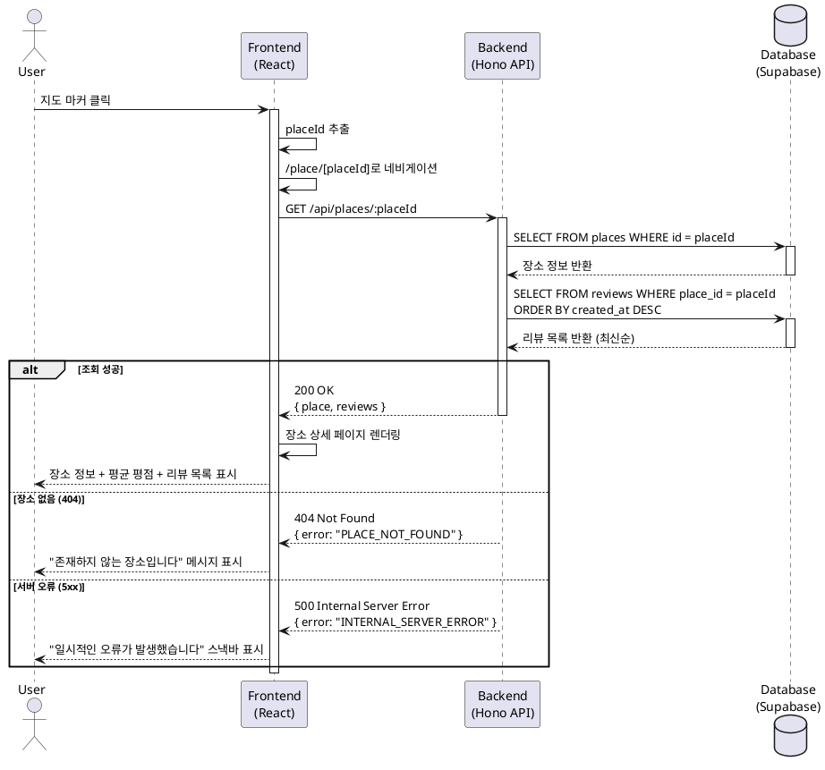

# Usecase 005: 장소 상세 정보 조회 (지도 마커 경유)

## Primary Actor
- 탐색자 (Explorer): 지도의 마커를 클릭하여 특정 음식점의 상세 정보와 리뷰를 조회하려는 사용자

## Precondition
- 사용자가 메인 (지도) 페이지에 접속해 있어야 함
- 지도에 리뷰가 1개 이상 등록된 음식점의 마커가 표시되어 있어야 함
- 클릭하려는 마커에 유효한 `placeId`가 연결되어 있어야 함

## Trigger
- 사용자가 지도 위에 표시된 특정 장소의 마커(Marker)를 클릭함

## Main Scenario

### 1. 마커 클릭 및 placeId 식별
- 사용자가 메인 페이지의 지도에서 특정 마커를 클릭함
- 프론트엔드가 마커 클릭 이벤트를 감지하고, 해당 마커와 연결된 `placeId`를 추출함
- 프론트엔드가 `/place/[placeId]` 경로로 네비게이션을 시작함

### 2. 장소 상세 정보 요청
- 프론트엔드가 백엔드 API `/api/places/:placeId`로 GET 요청을 전송함
- 요청 파라미터: `placeId` (UUID)

### 3. 장소 정보 조회
- 백엔드가 `places` 테이블에서 해당 `placeId`의 장소 정보를 조회함
- 조회 데이터: `id`, `name`, `address`, `category`, `average_rating`, `review_count`

### 4. 리뷰 목록 조회
- 백엔드가 `reviews` 테이블에서 해당 `placeId`와 연결된 모든 리뷰를 조회함
- 리뷰는 최신순(`created_at DESC`)으로 정렬됨
- 조회 데이터: `id`, `author_name`, `rating`, `content`, `created_at`, `updated_at`

### 5. 평균 평점 확인
- 백엔드가 조회된 장소 정보의 `average_rating` 값을 포함하여 응답함
- 평균 평점은 리뷰 작성/수정/삭제 시 자동으로 계산되어 `places` 테이블에 저장됨

### 6. 응답 반환
- 백엔드가 장소 정보와 리뷰 목록을 JSON 형태로 프론트엔드에 반환함
```json
{
  "place": {
    "id": "uuid",
    "name": "맛있는 식당",
    "address": "서울특별시 강남구...",
    "category": "한식",
    "averageRating": 4.5,
    "reviewCount": 10
  },
  "reviews": [
    {
      "id": "uuid",
      "authorName": "맛객",
      "rating": 5,
      "content": "정말 맛있어요!",
      "createdAt": "2025-10-20T12:00:00Z",
      "updatedAt": "2025-10-20T12:00:00Z"
    }
  ]
}
```

### 7. 장소 상세 페이지 렌더링
- 프론트엔드가 `/place/[placeId]` 페이지에서 받은 데이터를 렌더링함
- 페이지 구성:
  - 상단: 장소 기본 정보 (가게명, 주소, 업종)
  - 평균 평점 표시
  - '리뷰 작성하기' 버튼
  - 리뷰 목록 (최신순, 각 리뷰에 '수정'/'삭제' 버튼 포함)

## Edge Cases

### EC-1: 유효하지 않은 placeId
- **상황**: 마커에 `placeId`가 없거나 유효하지 않은 값인 경우
- **처리**: 프론트엔드가 사용자에게 "장소 정보를 불러올 수 없습니다" 메시지를 표시하고 메인 페이지에 머물게 함

### EC-2: 장소 정보 조회 실패 (404)
- **상황**: DB에 해당 `placeId`의 장소가 존재하지 않는 경우
- **처리**: 백엔드가 404 상태 코드와 에러 메시지를 반환함. 프론트엔드가 "존재하지 않는 장소입니다" 메시지를 표시함

### EC-3: 데이터베이스 연결 오류 (5xx)
- **상황**: DB 조회 중 서버 오류가 발생하는 경우
- **처리**: 백엔드가 500 상태 코드와 에러 메시지를 반환함. 프론트엔드가 "일시적인 오류가 발생했습니다. 잠시 후 다시 시도해주세요" 메시지를 스낵바로 표시함

### EC-4: 리뷰가 없는 장소
- **상황**: 장소는 존재하지만 리뷰가 0개인 경우 (정상적으로는 발생하지 않아야 함. 마커 표시 조건: `review_count > 0`)
- **처리**: 장소 정보는 정상 표시하되, 리뷰 목록 영역에 "아직 작성된 리뷰가 없습니다" 메시지를 표시함

### EC-5: 네트워크 지연/타임아웃
- **상황**: API 요청이 지연되거나 타임아웃되는 경우
- **처리**: 프론트엔드가 로딩 스피너를 표시하고, 타임아웃 발생 시 "네트워크 연결을 확인해주세요" 메시지를 표시함

## Business Rules

### BR-1: 마커 표시 조건
- 지도에 표시되는 마커는 반드시 `review_count > 0`인 장소만 해당함
- 따라서 마커를 클릭하여 진입한 장소 상세 페이지에는 항상 1개 이상의 리뷰가 존재해야 함

### BR-2: 평균 평점 계산
- 평균 평점은 해당 장소에 작성된 모든 리뷰의 평점(1-5)을 산술 평균하여 소수점 첫째 자리까지 반올림한 값
- 계산 공식: `ROUND(AVG(rating), 1)`
- 평균 평점은 리뷰 작성/수정/삭제 시 자동으로 재계산되어 `places.average_rating`에 업데이트됨

### BR-3: 리뷰 정렬 순서
- 장소 상세 페이지의 리뷰 목록은 항상 최신순(`created_at DESC`)으로 정렬됨

### BR-4: 리뷰 수정/삭제 권한
- 각 리뷰에 표시되는 '수정'/'삭제' 버튼은 모든 사용자에게 노출됨
- 실제 수정/삭제는 비밀번호 인증을 통과한 사용자만 가능함 (별도 유스케이스: UC-003, UC-004)

### BR-5: API Specification

#### Endpoint
```
GET /api/places/:placeId
```

#### Request
- **Path Parameters**
  - `placeId` (required): UUID 형식의 장소 고유 ID

- **Headers**
  - `Content-Type: application/json`

#### Response (Success: 200 OK)
```typescript
{
  place: {
    id: string;              // UUID
    name: string;            // 장소명
    address: string;         // 주소
    category: string;        // 업종
    averageRating: number;   // 평균 평점 (0.0 ~ 5.0, 소수점 1자리)
    reviewCount: number;     // 리뷰 개수
  };
  reviews: Array<{
    id: string;              // UUID
    authorName: string;      // 작성자명
    rating: number;          // 평점 (1-5)
    content: string;         // 리뷰 내용
    createdAt: string;       // ISO 8601 형식
    updatedAt: string;       // ISO 8601 형식
  }>;
}
```

#### Response (Error)
- **404 Not Found**: 해당 placeId의 장소가 존재하지 않음
```json
{
  "error": "PLACE_NOT_FOUND",
  "message": "존재하지 않는 장소입니다"
}
```

- **500 Internal Server Error**: 서버 내부 오류
```json
{
  "error": "INTERNAL_SERVER_ERROR",
  "message": "일시적인 오류가 발생했습니다"
}
```

### BR-6: Database Operations

#### Query 1: 장소 정보 조회
```sql
SELECT
  id,
  name,
  address,
  category,
  average_rating,
  review_count
FROM places
WHERE id = $1;
```

#### Query 2: 리뷰 목록 조회
```sql
SELECT
  id,
  author_name,
  rating,
  content,
  created_at,
  updated_at
FROM reviews
WHERE place_id = $1
ORDER BY created_at DESC;
```

#### 성능 최적화
- `places.id`는 Primary Key이므로 인덱스가 자동 생성됨
- `reviews.place_id`에는 외래키 인덱스(`idx_reviews_place_id`)가 설정되어 있어 빠른 조회 가능
- `reviews.created_at`에는 내림차순 인덱스(`idx_reviews_created_at`)가 설정되어 정렬 성능 최적화

## Sequence Diagram



## Related Usecases
- **UC-001**: 장소(음식점) 검색
- **UC-002**: 신규 리뷰 작성 및 저장
- **UC-003**: 기존 리뷰 수정
- **UC-004**: 기존 리뷰 삭제

## Notes
- 이 유스케이스는 읽기 전용(Read-only) 작업으로, DB에 데이터를 변경하지 않음
- 리뷰 작성, 수정, 삭제는 별도의 유스케이스로 분리되어 있음
- 장소 상세 페이지는 SSR(Server-Side Rendering) 또는 CSR(Client-Side Rendering) 모두 가능하나, SEO를 고려하여 SSR 권장
